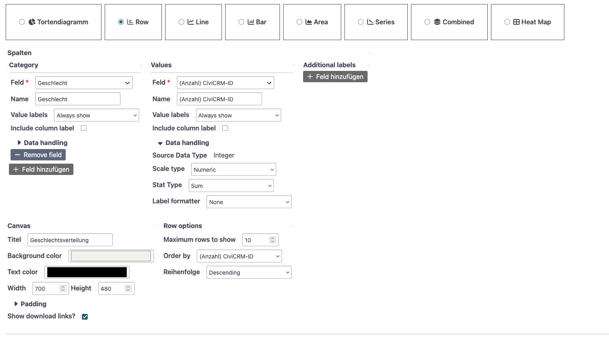
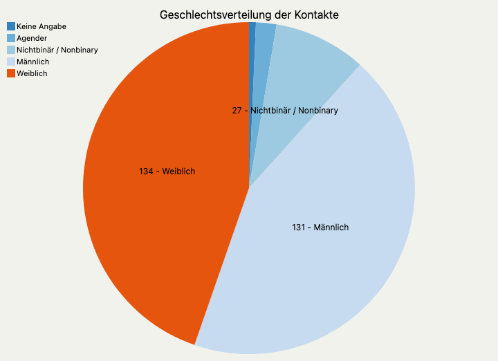
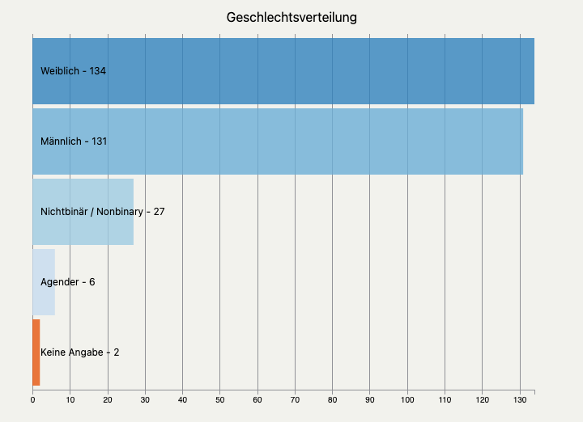

# SearchKit & ChartKit

**Wir verwenden die Tools, die bereits in CiviCRM vorhanden sind, um Daten zu analysieren und zu visualisieren.**

[🧹 daten-organisieren](./../1-datenlebenszyklus.md#daten-organisieren): CiviCRM Datenbank <br>
[🔢 daten-auswerten](./../1-datenlebenszyklus.md#daten-auswerten): [SearchKit](./../3-tools/1-civicrm_intern/4-civicrm-searchkit-chartkit.md#searchkit) <br>
[📊 daten-visualisieren](./../1-datenlebenszyklus.md#daten-visualisieren): [ChartKit](./../3-tools/1-civicrm_intern/4-civicrm-searchkit-chartkit.md#chartkit) <br>

## Voraussetzungen
- [SearchKit](./../3-tools/1-civicrm_intern/4-civicrm-searchkit-chartkit.md#searchkit) ist installiert
- [ChartKit](./../3-tools/1-civicrm_intern/4-civicrm-searchkit-chartkit.md#chartkit)-Erweiterung ist installiert

## Anleitung
### Setup
kein weiterer Setup nötig. :) 


### Datenauswertung

1. Legt eine neue Suche in SearchKit an oder bearbeitet eine existierende Suche. Im Visualisierungsschritt habt ihr Zugriff auf die Spalten der Ergebnisse der SearchKit-Suche. Überlegt euch daher schon jetzt, welche Datenpunkte eure Visualisierung benötigt.

### Visualisierung
1. im SearchKit Editor links Hinzufügen -> Diagramm


2. im ChartKit Editor können verschiedene Visualisierungstypen über ein grafisches User Interface konfiguriert werden. Verwendet werden können die Spalten der Ergebnisse der SearchKit Suche.



### Use Case: Darstellung der Geschlechtsverteilung

Einfache grafische Darstellungen sind hilfreich, um z.B. die Zusammensetzung der eigenen Zielgruppe zu verstehen. Hier machen wir eine einfache Auswertung der Geschlechtsverteilung unserer Kontakte.

Die Tabelle, die aus unserer SearchKit-Suche herauskommt, sieht wie folgt aus:

| Geschlecht               | Anzahl CiviCRM-ID |
|--------------------------|------------------|
| Weiblich                 | 134               |
| Männlich                 | 131               |
| Nichtbinär / Nonbinary   | 27                |
| Agender                  | 6                 |
| Keine Angabe             | 2                 |


```admonish info title="Diese Suche importieren"
Ihr könnt die Suche bei euch importieren über SearchKit -> Import. Den Code findet ihr [hier](https://github.com/CorrelAid/cdl_civicrm_analyse/supporting_code/searchkit). Voraussetzung ist, dass die Geschlechtsvariable bei euch gleich benannt sind.
```

Um die Daten darzustellen, können wir wie oben beschrieben ChartKit nutzen. Hier haben wir zwei Visualisierungen erstellt, ein Torten- und ein Balkendiagramm.

Ihr könnt eure Visualisierungen **in CiviCRM im Browser ansehen**. Personen, die Zugriff auf die CiviCRM-Suche haben, haben auch Zugriff auf die dazugehörigen ChartKit-Visualisierungen. Es ist nicht möglich, diesen Link mit Externen ohne CiviCRM-Account zu teilen.


Mithilfe der eingebetteten Download-Links könnt ihr sie als **PNG- oder SVG-Datei herunterladen**.





## Fazit

SearchKit und ChartKit ermöglichen in CiviCRM einen **unkomplizierten, voraussetzungsniedrigen Setup für Datenanalyse und Visualisierung**. ChartKit ist direkt in SearchKit integriert, sodass Visualisierungen direkt bei den dazugehörigen Suchen gespeichert werden. Das bedeutet allerdings, dass ihr eure Visualisierungen nicht anders anordnen oder sortieren könnt, z.B. in einem Dashboard. Auch könnt ihr eure Visualisierungen nicht direkt über Links mit externen Stakeholdern teilen oder zugänglich machen. Dafür ist die Exportfunktion gut zugänglich.  

Die Kombination von Search- und ChartKit ist gut geeignet, wenn ihr **ausgewählte Visualisierungen direkt in CiviCRM** verfügbar haben wollt und diese **nur selten und anlassbezogen exportieren** müsst. Wenn ihr Darstellungen live mit Externen teilen oder ein Dashboard bauen wollt oder generell höhere Anforderungen an die Gestaltung habt, seid ihr (noch) auf externe Tools angewiesen.
