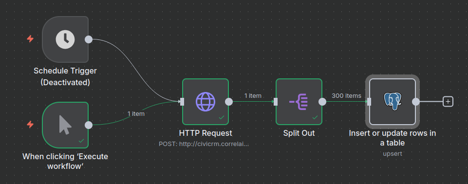
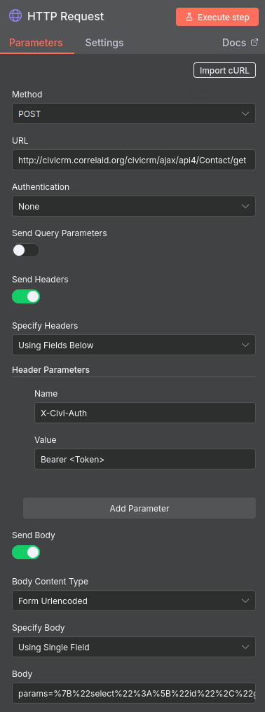
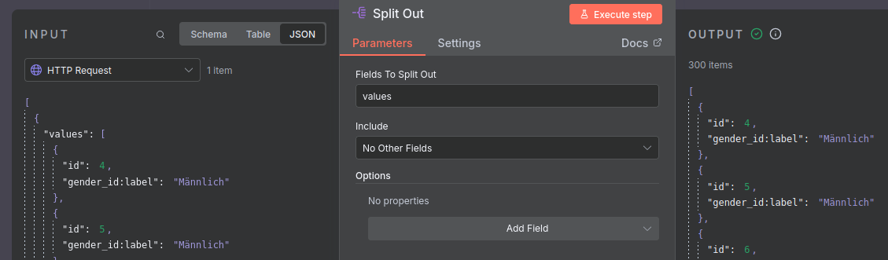
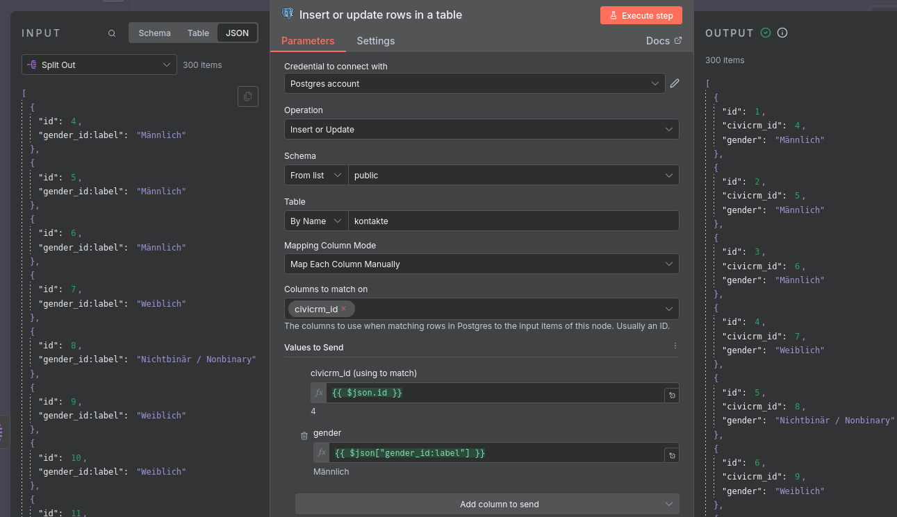
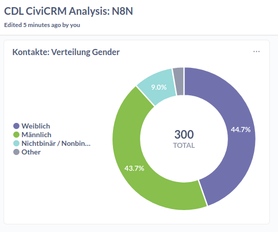

# Basic ETL mit n8n - Einfache deskriptive Statistiken

**Wir orchestrieren einen ETL-Prozess (Extract, Transform & Load) mit n8n um die Frage zu beantworten, wie sich Gender unter den in CiviCRM erfassten Kontakten verteilt und wollen dies mit einen Donut-Chart visualisieren.**

[🧹 daten-organisieren](./../../1-datenlebenszyklus.md#daten-organisieren): [CiviCRM API Explorer](./../../3-tools/1-civicrm_intern/3-civicrm-api.md#api-explorer) & [Neon](./../../3-tools/4-managed-datenbank.md#neon); [CiviCRM API](./../../3-tools/1-civicrm_intern/3-civicrm-api.md) & [n8n](../../3-tools/5-workflow-tools.md#n8n)<br>
[🔢 daten-auswerten](./../../1-datenlebenszyklus.md#daten-auswerten): [Metabase](./../../3-tools/3-bi-tools.md#metabase) <br>
[📊 daten-visualisieren](./../../1-datenlebenszyklus.md#daten-visualisieren): [Metabase](./../../3-tools/3-bi-tools.md#metabase) <br>


## Voraussetzungen

- Account bei [Neon](./../../3-tools/4-managed-datenbank.md#anlegen-einer-datenbank-und-tabelle)
- [API-Token](./../../3-tools/1-civicrm_intern/3-civicrm-api.md#api-einrichten) für eine CiviCRM-Instanz
- n8n-Instanz oder ein Abonnement des n8n SaaS
- Metabase-Instanz oder ein Abonnement des Metabase SaaS

## Anleitung

Dieser Ansatz besteht aus vier Komponenten, die wir nacheinander vorbereiten.

### A: Anlegen einer Tabelle in der Managed Datenbank (Neon)

#### Option 1: GUI

Erstelle eine neue Tabelle (wie [hier](../../3-tools/4-managed-datenbank.md#anlegen-einer-datenbank-und-tabelle) beschrieben)

  - Gebe der Tabelle den Namen `kontakte`
  - Füge die Spalten `civicrm-id` und `gender` hinzu
  - Wähle für `civicrm-id` den Datentyp `integer` und die contraints `Not null`, sowie `Unique` aus
  - Wähle für `gender` den Datentyp `varchar` und den contraints `Not null` aus


```admonish tldr title="Constraints"
Constraints sind Regeln, die die Datenintegrität und -konsistenz gewährleisten, indem sie festlegen, welche Daten wie in Tabellen gespeichert werden dürfen. Sie dienen als Datenvalidierungsprüfungen auf Ebene der Datenbank.
```

#### Option 2: SQL-Editor

Die Tabelle lässt sich im SQL-Editor von Neon durch das Ausführen des folgenden Codes erstellen:

 ```sql
 CREATE TABLE "kontakte" (
  "id" integer PRIMARY KEY GENERATED ALWAYS AS IDENTITY (sequence name "kontakte_id_seq"),
  "civicrm_id" integer NOT NULL UNIQUE,
  "gender" varchar
);
```

```admonish question title="Wo finde ich mehr Beispiel-Code?"
Diesen und anderen SQL-Code findet ihr auch im [Repository](https://github.com/CorrelAid/cdl_civicrm_analyse) in dem Ordner `supporting_code/sql`.
```

### B: Datenmodellierung im API-Explorer von CiviCRM

Navigiert zum [API Explorer](../../3-tools/1-civicrm_intern/3-civicrm-api.md#api-explorer) und wählt als Entität `Contact`, sowie als Aktion `get` aus. Unter select, wählt `gender_id:label` und `id` aus. Wichtig ist, dass ihr außerdem `-1` bei `limit` setzt, um alle Daten zu erhalten. Bei diesem Use Case beschränkt sich die Datenmodellierung auf die Feldauswahl. 

```admonish tldr title="Tabellen in CiviCRM"
`gender` ist eine separate Tabelle, die alle auf dieser CiviCRM-Instanz auswählbaren Gender enthält. Kontakte haben ein Feld mit dem Namen `gender_id`, das die ID einer Reihe in der Gender-Tabelle enthält, die zum Beispiel als Spalte `Label` hat. 
```


Nach diesen Schritten könnt ihr bereits den Request Body weiter unten unter REST kopieren. Dies sollte entsprechen: 

```
params=%7B%22select%22%3A%5B%22gender_id%3Alabel%22%2C%22id%22%5D%7D
```
### C: Anlegen des Flows in n8n

Erstellt einen neuen Workflow auf eurer n8n-Instanz. Am Ende sollte dieser so aussehen:



```admonish info title="Diesen Flow importieren"
Den Flow als importierbare Datei findet ihr auch im [Repository](https://github.com/CorrelAid/cdl_civicrm_analyse) in dem Ordner `supporting_code/n8n_flows`
```

Als **Trigger** dient sowohl die manuelle Ausführung als auch eine Schedule (regelmäßig terminiertes Ausführen). Letzteres kann zum Beispiel einmal am Tag geschehen. 

### D: Knoten für die API-Anfrage anlegen

Der erste richtige Knoten enthält die **API-Anfrage**. Unten seht ihr, wie ihr ihn konfigurieren müsst.



1. Fügt unter URL am Anfang die URL eurer Instanz ein. Im API Explorer unter dem Reiter **REST** ist dies auch als Variable `CRM_URL` definiert. 

2. Fügt euer API-Token an der Stelle ein, wo im Screenshot \<Token> steht.

3. Im Feld Body, das bei Setzen der oben angezeigten Optionen erscheint, fügt ihr nun den im API-Explorer generierten Body ein (siehe oben). 

4. Ihr könnt nun eure Angaben direkt mit einem Klick auf **Execute Workflow** testen.

```admonish tldr title="Viele Daten?"
Wenn ihr mehr als wenige hundert Kontakte in CiviCRM habt, oder viele Datenfelder verarbeiten wollt, solltet ihr nicht alle Daten auf einmal anfragen, sondern mit Pagination arbeiten. Dies lässt sich im API-Explorer konfigurieren und in n8n [so](https://docs.n8n.io/integrations/builtin/core-nodes/n8n-nodes-base.httprequest/#pagination) berücksichtigen.
```

### E: Knoten für die Separation von Zeilen anlegen

Der Output des vorherigen Knotens ist standardmäßig ein `json` Objekt, das die Daten als Liste als Wert des keys `values` enthält. Der Knoten-Typ **Split Out** ermöglicht es uns, diese Liste, bzw. deren Einträge zu isolieren. 



Die Konfiguration dieses Knotens ist simpel: füllt das Feld **Values to Split Out** einfach mit dem Wert `values`.

### F: Knoten für das Laden der Daten in die managed Datenbank anlegen

Dieser letzte Knoten ist für das Laden der Daten in die managed Datenbank auf Neon, unser Data Warehouse, zuständig. 

  1. Legt zunächst ein Credential für Postgres an. Wie dies funktioniert, ist [hier](https://docs.n8n.io/credentials/add-edit-credentials/) beschrieben. Die notwendigen Informationen findet ihr in der [Neon Konsole](https://neon.com/docs/connect/connect-from-any-app).


  2. Wenn ihr dies erledigt habt, nutzt den Knoten-Typ für Postgres: **Insert or update rows in a table** und konfiguriert ihn so wie im Bild unten. 



```admonish info title="Unterschiede zwischen IDs"
Bei der Zuordnung der Felder aus der API zu den Spalten der Tabelle ist wichtig, dass es einen Unterschied zwischen `id` und `civicrm_id` gibt. Ersteres wird automatisch durch die Datenbank erstellt, zweiteres erlaubt Updates von bereits vorhanden Kontakten durch die Referenz dieser. So wird sichergestellt, dass bei erneutem Laden der Daten keine Duplikate entstehen, sondern vorhandene Reihen geupdatet werden.
```

```admonish tldr title="Full Load"
In den Begriffen des Data Engineering vollziehen wir hier einen regelmäßigen **Full Load**. Eine alternative wäre ein ressourcensparender **Incremental Load**, bei dem nur *neue* Daten geladen werden. *Neu* könnte mit Bezug auf Kontakte solche meinen, die geupdatet oder tatsächlich neu hinzugekommen sind. 

Das Anlegen von Incremental Loads kann jedoch komplex werden, weil sie Informationen wie das Datum eines Updates und die zuverlässige Sortierung von Ergebnissen der Items einer API-Anfrage voraussetzen.
```

### G: Visualisierung in Metabase

1. Verbindet wie [hier](../../3-tools/3-bi-tools.md#mb-db-hinzufuegen) beschrieben die Datenbank mit Metabase. An die notwendigen Informationen kommt ihr ähnlich wie beim Anlegen der Postgres Credentials für den letzten Knoten des Workflows. 

2. Lest euch den Abschnitt zu [Visualisierung in Metabase](../../3-tools/3-bi-tools.html#mb-daten-analysieren) durch. Die obige Visualisierung ist ein **Pie-Chart**, für den die Daten mit der **Summarize** Funktion verarbeitet wurden, indem die Reihen pro Gender gezählt wurden.

<br/>




## Fazit

Mit dem vorgestellten Tool-Setup lässt sich der Use Case ohne Code umsetzen, in dem viel Komplexität abstrahiert und versteckt wird. Für simple Use Cases reicht das obige Setup aus. Die Funktionalitäten von n8n sind für anspruchsvollere Data Orchestration jedoch begrenzt. 

Ein wesentlicher Nachteil ist die deutlich langsamere Iteration beim Debugging: Workflows müssen komplett durchlaufen werden, Zwischenschritte sind schwer inspizierbar, und es fehlen Debugging-Tools wie Breakpoints oder detaillierte Logs. Zudem ist das Setup weniger transparent als code-basierte Lösungen – Versionskontrolle via Git, Code Reviews und Knowledge Transfer sind schwieriger, da Tool-spezifisches Wissen erforderlich ist. Die Flexibilität ist eingeschränkt, wenn komplexe Transformationslogik benötigt wird, die über die verfügbaren Nodes hinausgeht. Schließlich entsteht ein Vendor Lock-in: Eine Migration zu anderen Tools ist aufwendig, und man ist abhängig von der Weiterentwicklung der eingesetzten Produkte. 

