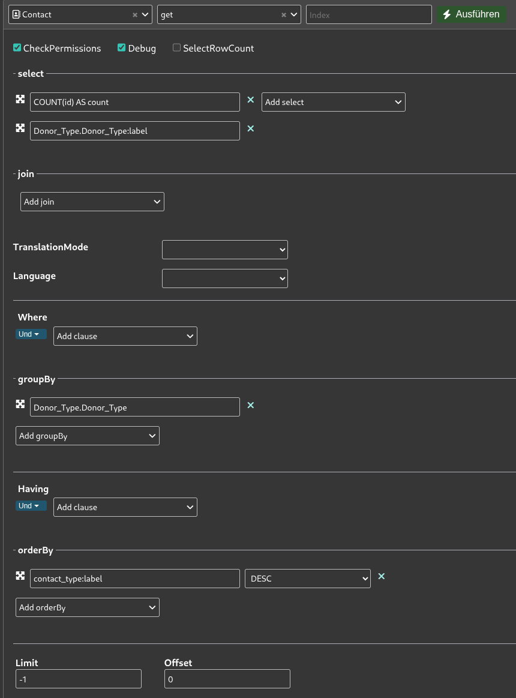
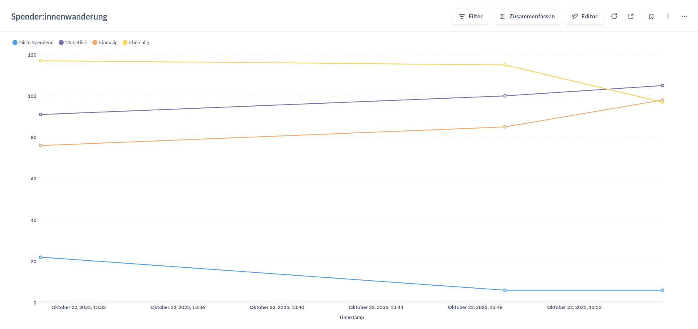

# ETL mit Kestra - Spender:innenwanderungen über die Zeit

**Wir orchestrieren einen ETL-Prozess (Extract, Transform & Load) mit Kestra um die Frage zu beantworten, wie sich Spender:innentypen über die Zeit entwickeln. Dazu aggregieren wir Daten über die CiviCRM API und laden sie täglich in eine Datenbank, um die Entwicklung mit einem Line-Chart zu visualisieren.**

[🧹 daten-organisieren](./../../1-datenlebenszyklus.md#daten-organisieren): [CiviCRM API Explorer](./../../3-tools/1-civicrm_intern/3-civicrm-api.md#api-explorer) & [Neon](./../../3-tools/4-managed-datenbank.md#neon); [CiviCRM API](./../../3-tools/1-civicrm_intern/3-civicrm-api.md) & [Kestra](../../3-tools/5-workflow-tools.md#kestra)<br>
[🔢 daten-auswerten](./../../1-datenlebenszyklus.md#daten-auswerten): [Metabase](./../../3-tools/3-bi-tools.md#metabase) <br>
[📊 daten-visualisieren](./../../1-datenlebenszyklus.md#daten-visualisieren): [Metabase](./../../3-tools/3-bi-tools.md#metabase) <br>


## Voraussetzungen

- Account bei [Neon](./../../3-tools/4-managed-datenbank.md#anlegen-einer-datenbank-und-tabelle)
- [API-Token](./../../3-tools/1-civicrm_intern/3-civicrm-api.md#api-einrichten) für eine CiviCRM-Instanz
- Kestra-Instanz oder ein Abonnement des Kestra SaaS
- Metabase-Instanz oder ein Abonnement des Metabase SaaS
- Benutzerdefiniertes Datenfeld [Donor Type](../../3-tools/1-civicrm_intern/1-erweiterung-daten.md) in CiviCRM

## Anleitung

Dieser Ansatz besteht aus 5 Komponenten , die wir nacheinander vorbereiten. 

### A: Erweiterung der CiviCRM Datenfelder

Wie [hier](../../3-tools/1-civicrm_intern/1-erweiterung-daten.md) beschrieben, benötigen wir ein neues **benutzerdefiniertes Datenfeld**, das den Typ einer spendenden Person erfasst. Für Demonstrationszwecke halten wir es simpel und legen das Feld **Donor Type** als **Auswahlliste** mit den Optionen **One Time Donor**, **Monthly Donor** und **Past Donor** an. Die Benennung ist dabei beliebig veränderbar und es könnten auch mehr Optionen genutzt werden.

```admonish info title="Integration in die Datenerfassung"
Für unseren Test erstellen wir programmatisch Testdaten mit diesem Datenfeld. In der Realität müsst ihr dieses neue Feld jedoch in eure Erfassung von Kontakten integrieren, oder die Information anderweitig erfassen. Eine Option ist zum Beispiel die Nutzung von **Gruppen** für Kontakte. Auf Englisch ist dies [hier](https://docs.civicrm.org/user/en/latest/organising-your-data/smart-groups) dokumentiert. Ihr könntet Gruppen mit Kriterien wie *ist zu einer Contribution zugeordnet* anlegen.
```

### B: Anlegen einer Tabelle in der Managed Datenbank (Neon)

#### Option 1: GUI

Erstelle eine neue Tabelle (wie [hier](../../3-tools/4-managed-datenbank.md#anlegen-einer-datenbank-und-tabelle) beschrieben):

- Gebe der Tabelle den Namen `spendende_typen_agg`
- Füge die Spalte `timestamp` mit dem Datentyp `timestamp` und dem Constraint `Not null` hinzu
- Füge für jeden Spender:innentyp eine Spalte hinzu (z.B. `nicht_spendend`, `einmalig`, `monatlich`, `ehemalig`)
- Wähle für diese Spalten den Datentyp `integer` und den Constraint `Not null` aus

```admonish tldr title="Constraints"
Constraints sind Regeln, die die Datenintegrität und -konsistenz gewährleisten, indem sie festlegen, welche Daten wie in Tabellen gespeichert werden dürfen. Sie dienen als Datenvalidierungsprüfungen auf Ebene der Datenbank.
```

#### Option 2: SQL-Editor

Die Tabelle lässt sich im SQL-Editor von Neon durch das Ausführen des folgenden Codes erstellen:

```sql
CREATE TABLE IF NOT EXISTS "spendende_typen_agg" (
  "id" integer PRIMARY KEY GENERATED ALWAYS AS IDENTITY (
    sequence name "spendende_typen_agg_id_seq"
  ),
  "timestamp" timestamp NOT NULL,
  "nicht_spendend" integer NOT NULL,
  "monatlich" integer NOT NULL,
  "einmalig" integer NOT NULL,
  "ehemalig" integer NOT NULL
);
```

```admonish question title="Wo finde ich mehr Beispiel-Code?"
Diesen und anderen SQL-Code findet ihr auch im [Repository](https://github.com/CorrelAid/cdl_civicrm_analyse) in dem Ordner `supporting_code/sql`.
```

### C: Datenmodellierung im API-Explorer von CiviCRM

Navigiert zum [API Explorer](../../3-tools/1-civicrm_intern/3-civicrm-api.md#api-explorer) und wählt als Entität `Contact`, sowie als Aktion `get` aus. Hier besteht die Datenmodellierung nun aus einer Aggregation nach dem Typ der spendenden Person.



Konfiguriert die API-Anfrage so wie in dem Screenshot oben:

1. Wählt unter **select** die Felder `COUNT(id) AS count` und `Donor_Type.Donor_Type:label` aus
2. Nutzt die **groupBy** Funktion, um die Reihen nach `Donor_Type.Donor_Type` zu gruppieren
3. Sortiert die Ergebnisse unter **orderBy** nach `contact_type:label` in absteigender Reihenfolge (`DESC`)

Nach diesen Schritten könnt ihr bereits den Request Body weiter unten unter REST kopieren. Dies sollte in etwa so aussehen:

```
params=%7B%22select%22%3A%5B%22COUNT%28id%29%20AS%20count%22%2C%22Donor_Type.Donor_Type%3Alabel%22%5D%2C%22orderBy%22%3A%7B%22contact_type%3Alabel%22%3A%22DESC%22%7D%2C%22groupBy%22%3A%5B%22Donor_Type.Donor_Type%22%5D%7D
```

### D: Anlegen des Flows in Kestra

Erstellt einen neuen Workflow auf eurer Kestra-Instanz. Der vollständige Flow als YAML:

```yaml
id: civicrm_donor_type_count_warehouse
namespace: company.team
tasks:
  - id: request
    type: io.kestra.plugin.core.http.Request
    uri: "{{ secret('CIVICRM_API_URI') }}"
    headers:
      X-Civi-Auth: "Bearer {{ secret('CIVICRM_API_TOKEN') }}"
    method: POST
    contentType: application/x-www-form-urlencoded
    body: |
      params=%7B%22select%22%3A%5B%22COUNT%28id%29%20AS%20count%22%2C%22Donor_Type.Donor_Type%3Alabel%22%5D%2C%22orderBy%22%3A%7B%22contact_type%3Alabel%22%3A%22DESC%22%7D%2C%22groupBy%22%3A%5B%22Donor_Type.Donor_Type%22%5D%7D

  - id: to_rows
    type: io.kestra.plugin.transform.jsonata.TransformValue
    from: "{{ outputs.request.body }}"
    expression: |
      [{
        "nicht_spendend": $sum(values[$."Donor_Type.Donor_Type:label" = null].count),
        "ehemalig":       $sum(values[$."Donor_Type.Donor_Type:label" = "Past Donor"].count),
        "monatlich":      $sum(values[$."Donor_Type.Donor_Type:label" = "Monthly Donor"].count),
        "einmalig":       $sum(values[$."Donor_Type.Donor_Type:label" = "One Time Donor"].count)
      }]

  - id: insert_agg
    type: io.kestra.plugin.jdbc.postgresql.Query
    url: "jdbc:postgresql://{{ secret('CIVICRM_NEON_WAREHOUSE_HOST') }}:5432/main"
    username: "{{ secret('CIVICRM_NEON_WAREHOUSE_USER') }}"
    password: "{{ secret('CIVICRM_NEON_WAREHOUSE_PW') }}"
    sql: |
      INSERT INTO spendende_typen_agg(timestamp, nicht_spendend, ehemalig, monatlich, einmalig)
      SELECT NOW(), nicht_spendend, ehemalig, monatlich, einmalig
      FROM jsonb_to_recordset('{{ outputs.to_rows.value }}'::jsonb)
      AS t(nicht_spendend int, ehemalig int, monatlich int, einmalig int);
    fetchType: NONE
    
triggers:
  - id: schedule
    type: io.kestra.plugin.core.trigger.Schedule
    cron: 0 0 * * 0
```

```admonish question title="Diesen Flow importieren"
Diesen und andere Kestra-Flows findet ihr auch im [Repository](https://github.com/CorrelAid/cdl_civicrm_analyse) in dem Ordner `supporting_code/kestra_flows`
```

#### 1. Knoten für die API-Anfrage

Der erste Knoten enthält die **API-Anfrage**:

1. Fügt unter `uri` am Anfang die URL eurer Instanz ein. Im API Explorer unter dem Reiter **REST** ist dies auch als Variable `CRM_URL` definiert
2. Fügt euer API-Token als Secret ein (siehe oben)
3. Im Feld `body` fügt ihr den im API-Explorer generierten Body ein (siehe oben)

Ein Beispiel-Output der API-Anfrage ist:

```json
{
  "values": [
    {"count": 22, "Donor_Type.Donor_Type:label": null},
    {"count": 76, "Donor_Type.Donor_Type:label": "One Time Donor"},
    {"count": 117, "Donor_Type.Donor_Type:label": "Past Donor"},
    {"count": 91, "Donor_Type.Donor_Type:label": "Monthly Donor"}
  ],
  "entity": "Contact",
  "action": "get",
  "debug": null,
  "version": 4,
  "count": 4,
  "countFetched": 4
}
```

#### 2. Knoten für die Verarbeitung mit JSONata

[JSONata](https://jsonata.org/) ist eine Sprache für die Abfrage und Verarbeitung von JSON-Daten. In diesem Fall transformieren wir die API-Antwort in ein Format, das sich direkt in unsere Datenbank-Tabelle einfügen lässt.

Der JSONata-Knoten nutzt die Expression:

```
[{
  "nicht_spendend": $sum(values[$."Donor_Type.Donor_Type:label" = null].count),
  "ehemalig":       $sum(values[$."Donor_Type.Donor_Type:label" = "Past Donor"].count),
  "monatlich":      $sum(values[$."Donor_Type.Donor_Type:label" = "Monthly Donor"].count),
  "einmalig":       $sum(values[$."Donor_Type.Donor_Type:label" = "One Time Donor"].count)
}]
```

**So funktioniert die Expression:**

1. **Filtern**: `values[$."Donor_Type.Donor_Type:label" = "Past Donor"]` durchsucht das Array `values` und filtert nur die Objekte, deren Label dem gesuchten Typ entspricht
2. **Extrahieren**: `.count` greift auf das `count`-Feld der gefilterten Objekte zu
3. **Aggregieren**: `$sum()` summiert alle gefundenen Werte (relevant wenn mehrere Matches existieren)
4. **Strukturieren**: Die eckigen Klammern `[]` erstellen ein Array mit einem einzelnen Objekt, dessen Keys (`nicht_spendend`, `ehemalig`, etc.) den Spaltennamen in unserer Datenbank entsprechen

Beispiel-Output:

```json
{ "ehemalig": 117, "einmalig": 76, "monatlich": 91, "nicht_spendend": 22 }
```

#### 3. Knoten für das Laden der Daten in die Managed Datenbank

Dieser letzte Knoten ist für das Laden der Daten in die Managed Datenbank auf Neon, unser Data Warehouse, zuständig:

1. Legt zunächst ein Secret für Postgres an. Die notwendigen Informationen findet ihr in der [Neon Konsole](https://neon.com/docs/connect/connect-from-any-app)
2. Konfiguriert den Knoten so, dass die transformierten Daten als neue Zeile mit dem aktuellen Timestamp in die Tabelle `spendende_typen_agg` eingefügt werden

```admonish info title="Secrets in Kestra"
Wenn ihr Kestra selbst hostet, könnt ihr API Tokens etc. als [Secrets](https://kestra.io/docs/concepts/secret#secrets-in-the-open-source-version) über Environment Variables anlegen.
```

**Die SQL-Query im Detail:**

```sql
INSERT INTO spendende_typen_agg(timestamp, nicht_spendend, ehemalig, monatlich, einmalig)
SELECT NOW(), nicht_spendend, ehemalig, monatlich, einmalig
FROM jsonb_to_recordset('{{ outputs.to_rows.value }}'::jsonb)
AS t(nicht_spendend int, ehemalig int, monatlich int, einmalig int);
```

**So funktioniert die Query:**

1. **`INSERT INTO spendende_typen_agg(...)`**: Definiert in welche Tabelle und Spalten die Daten eingefügt werden
2. **`NOW()`**: Erzeugt den aktuellen Timestamp für die Zeile, sodass wir später nachvollziehen können, wann diese Daten erfasst wurden
3. **`jsonb_to_recordset(...)`**: Konvertiert das JSON-Objekt aus dem vorherigen Knoten in eine relationale Tabellenstruktur
4. **`'{{ outputs.to_rows.value }}'`**: Kestra-Syntax um auf den Output des `to_rows`-Knotens zuzugreifen
5. **`AS t(nicht_spendend int, ...)`**: Definiert das Schema der temporären Tabelle `t` mit den entsprechenden Spaltentypen


```admonish tldr title="Regelmäßige Snapshots"
In den Begriffen des Data Engineering vollziehen wir hier regelmäßige **Snapshots**. Bei jeder Ausführung wird eine neue Zeile mit den aktuellen Zählungen der verschiedenen Spender:innentypen angelegt. So können wir die Entwicklung über die Zeit nachvollziehen.
```

### H: Visualisierung in Metabase

1. Verbindet wie [hier](../../3-tools/3-bi-tools.md#mb-db-hinzufuegen) beschrieben die Datenbank mit Metabase. An die notwendigen Informationen kommt ihr ähnlich wie beim Anlegen der Postgres Credentials für den letzten Knoten des Workflows

2. Lest euch den Abschnitt zu [Visualisierung in Metabase](../../3-tools/3-bi-tools.html#mb-daten-analysieren) durch. Die Visualisierung ist ein **Line-Chart**, der die Entwicklung der verschiedenen Spender:innentypen mit jeweils einer Linie über die Zeit darstellt. Nutzt die Spalte `timestamp` für die X-Achse und die verschiedenen Typen-Spalten für die Y-Achse

<br/>




## Fazit

Es lässt sich ein ähnliches Fazit wie für den Abschnitt zu [ETL mit n8n](1-etl-n8n.md) ziehen. Ein Unterschied ist die Erforderniss der Erweiterung der CiviCRM-Datenfelder, um das Informationen zu Spender:innen zu erfassen.

Kestra als Workflow Tool benötigt im Vergleich zu n8n deutlich mehr technische Skills. Ein wesentlicher Vorteil ist die Versionierbarkeit: Flows werden als YAML-Dateien definiert und können in Git-Repositories gespeichert werden, was Code Reviews, Knowledge Transfer und Zusammenarbeit im Team erheblich erleichtert. Zudem bietet Kestra deutlich mehr Flexibilität – die Code-Umgebung ist erweiterbar, und es stehen umfangreiche Transformationsmöglichkeiten zur Verfügung.


