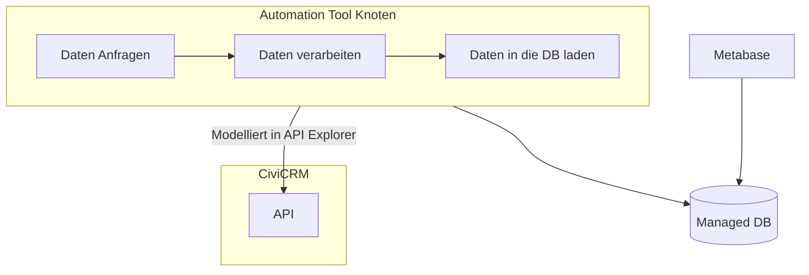

# CiviCRM API, Automation, Managed DB & Metabase

 

 

Bei dem hier vorgestellten Ansatz werden die Daten über die [API](../../3-tools/1-civicrm_intern/3-civicrm-api.md) bezogen, während der [Datenorganisationsschritt](../../1-datenlebenszyklus.html#daten-organisieren)  bzw. das **Data Modelling**, also z.B. die Auswahl der Datenfelder oder Aggregation einmalig über den [API Explorer](../../3-tools/1-civicrm_intern/3-civicrm-api.html#api-explorer) geschieht. Wie [hier](../../3-tools/1-civicrm_intern/3-civicrm-api.html#api-explorer) beschrieben, lassen sich die notwendigen Parameter über eine GUI generieren und kopieren. 

Die eigentliche API-Anfrage geschieht schließlich im [Workflow Automation Tool](../../3-tools/5-workflow-tools.md), das die Rolle der **Data Orchestration** erfüllt. Hier kann der Output des Requests auch verarbeitet werden, sodass die Daten anschließend in die externe [managed Datenbank](../../3-tools/4-managed-datenbank.md), das **Data Warehouse**, geladen werden kann. An diese Datenbank kann dann [Metabase](../../3-tools/3-bi-tools.md) angeschlossen werden, um die Daten zu visualisieren.

Diesen Ansatz wird anhand von zwei Use Cases veranschaulicht, bei denen jeweils eines der zwei ausgewählten Workflow Automation Tools verwendet wird. Zuerst erklären wir, wie man mit [n8n](../../3-tools/5-workflow-tools.html#n8n) durch das Duplizieren eines Datenausschnitts die Datengrundlage für die Visualisierung einfacher deskriptive Statistiken schaffen kann.

Danach wird der komplexere Use-Case der Visualisierung von Spender:innenwanderungen thematisiert. Nachdem notwendige Daten aggregiert in einem API-Request aggregiert wurden, geschieht dies mithilfe von [Kestra](../../3-tools/5-workflow-tools.html#kestra).

