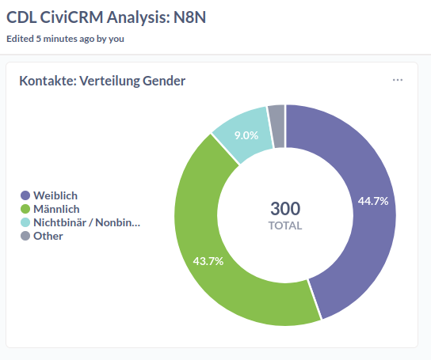

# Spendendewanderungen

Wie viele Menschen werden von einmaligen Spendende zu monatlichen Spendende? Wie viele Menschen kündigen ihre regelmäßige Spende? Hier beschäftigen wir uns mit der Entwicklung von Spendenkategorien.

### Anleitung 

### Erweiterung der CiviCRM Datenfelder

Wie [hier](../../3-tools/civicrm_intern/1-erweiterung-daten.md) beschrieben, benötigen wir ein neues **benutzerdefiniertes Datenfeld**, dass den Typ einer spendenden Person erfasst. Für Demonstrationszwecke halten wir es simpel und legen das Feld **Donor Type** als **Auswahlliste** mit den Optionen **One Time Donor**, **Monthly Donor** und **Past Donor** an. Die Benennung ist dabei beliebig veränderbar und es könnten auch mehr Optionen genutzt werden.

🤔 Hinweis: Für unseren Test erstellen wir programmatisch Testdaten mit diesem Dateifeld, in der Realität müsst ihr diesen neue Feld jedoch in eure Erfassung von Kontakten integrieren, oder die Information anderweitig erfassen. Eine Option ist zum Beispiel die Nutzung von **Gruppen** für Kontakte. Auf English ist dies [hier](https://docs.civicrm.org/user/en/latest/organising-your-data/smart-groups) dokumentiert. Ihr könntet Gruppen mit Kriterien wie *ist zu einer Contribution zugeordnet* anlegen.

### Anlegen einer Tabelle in der Managed Datenbank (Neon)

 Erstelle eine neue Tabelle, wie [hier](http://localhost:3000/3-tools/managed-datenbank.html#anlegen-einer-datenbank-und-tabelle) beschrieben, mit dem Namen *spendende_typen_agg* und füge neben der automatischen ID-Spalte jeweils eine Spalte für die Typen von Spendenden ein. Also z.B. **nicht_spendend** oder **einmalig**. Diese Spalten sollten den Typ **integer**, und als Contraints **Not null** haben. Weiterhin benötigen wir noch die Spalte **timestamp** mit dem gleichnamigen Datentyp ***timestamp** und dem Constraint **Not null**.

 Als SQL, das man auch in den SQL Editor einfügen kann, um die Tabelle zu erstellen, sieht das so aus:

```sql
CREATE TABLE IF NOT EXISTS"spendende_typen_agg" (
  "id" integer PRIMARY KEY GENERATED ALWAYS AS IDENTITY (
    sequence name "spendende_typen_agg_id_seq"
  ),
  "timestamp" timestamp NOT NULL,
  "nicht_spendend" integer NOT NULL,
  "monatlich" integer NOT NULL,
  "einmalig" integer NOT NULL,
  "ehemalig" integer NOT NULL
);
```

#### Datenmodellierung im API Explorer

Navigiert zum [API Explorer](../../3-tools/civicrm_intern/3-civicrm-api.html#api-explorer) und wählt als Entität **Contact**, sowie als Aktion **get** aus. Hier besteht die Datenmodellierung nun aus einer Aggregation nach dem Typ der spendenden Person. 


Konfiguriert die API-Anfrage so wie in dem Screenshot oben. Wir zählen die ids pro Spendenden-Typ und zeigen den Namen des Typs an. Außerdem nutzen wir die **groupBy** Funktion, um die Reihen nach Spendenden-Typ zu gruppieren. Wichtig ist weiterhin, dass wir die Ergebnisse sortieren, da wir später die Position in der Liste der Ergebnisse verwenden.

### Anlegen des Flows in Kestra

Hier ist der gesamte Flow als yaml:

```yaml
id: civicrm_donor_type_count_polars
namespace: company.team
tasks:
  - id: request
    type: io.kestra.plugin.core.http.Request
    uri: http://civicrm.correlaid.org/civicrm/ajax/api4/Contact/get
    headers:
      X-Civi-Auth: "Bearer {{ secret('CIVICRM_API_TOKEN') }}"
    method: POST
    contentType: application/x-www-form-urlencoded
    body: |
      params=%7B%22select%22%3A%5B%22COUNT%28id%29%20AS%20count%22%2C%22Donor_Type.Donor_Type%3Alabel%22%5D%2C%22orderBy%22%3A%7B%22contact_type%3Alabel%22%3A%22DESC%22%7D%2C%22groupBy%22%3A%5B%22Donor_Type.Donor_Type%22%5D%7D

```

#### Knoten: API-Anfrage

Ein Beispiel Output ist:

```json

{"values":[{"count":22,"Donor_Type.Donor_Type:label":null},{"count":76,"Donor_Type.Donor_Type:label":"One Time Donor"},{"count":117,"Donor_Type.Donor_Type:label":"Past Donor"},{"count":91,"Donor_Type.Donor_Type:label":"Monthly Donor"}],"entity":"Contact","action":"get","debug":null,"version":4,"count":4,"countFetched":4}

```

#### Knoten: Verarbeitung mit jsonata

[jsonata](https://jsonata.org/) ist eine Sprache für die Abfrage und Verarbeitung von Daten. In diesem Fall separieren wir die Zählungen der Typen durch folgende Anfrage:

```
$merge(
        $map(values, function($v) {
          {
            ($v."Donor_Type.Donor_Type:label" != null ? $v."Donor_Type.Donor_Type:label" : "Unlabeled"): $v.count
          }
        })
      )
```

Die JSONata-Anfrage iteriert mit $map über das Array `values` und erzeugt für jeden Eintrag ein Objekt, dessen Schlüssel dynamisch aus $v."Donor_Type.Donor_Type:label" stammt oder, falls null, auf Unlabeled gesetzt wird; der zugehörige Wert ist jeweils $v.count. Weil der Feldname Sonderzeichen enthält, wird er mit dem Pfad ."Donor_Type.Donor_Type:label" in Anführungszeichen adressiert. Anschließend fasst $merge alle Einzelobjekte zu einem einzigen flachen Objekt zusammen, sodass die Spendentypen ihren Zählwerten zugeordnet sind.

Beipsiel-Output 

```
{
  "Unlabeled": 22,
  "One Time Donor": 76,
  "Past Donor": 117,
  "Monthly Donor": 91
}
```

#### Knoten: Laden in die Datenbank

Die als Key und Value separierten Daten lassen sich nun 


🤔 Hinweis: Wenn ihr Kestra selbst hostet, könnt ihr API Tokens etc. als [Secrets](https://kestra.io/docs/concepts/secret#secrets-in-the-open-source-version) anlegen.

🤔 Kleiner Exkurs: In den Begriffen des Data Engineering vollziehen wir hier einen **Daily Snapshot**. 

### Visualisierung in Metabase

Verbindet wie [hier](http://localhost:3000/3-tools/bi-tools.html#verbinden-von-datenbanken-mit-metabase) beschrieben die Datenbank mit Metabase. An die notwendigen Informationen kommt ihr ähnlich wie beim Anlegen der Postgres Credentials für den letzten Knoten des Workflows. 



Die obige Visualisierung ist ein **Line-Chart**, der direkt auf die Daten angewendet werden kann.

