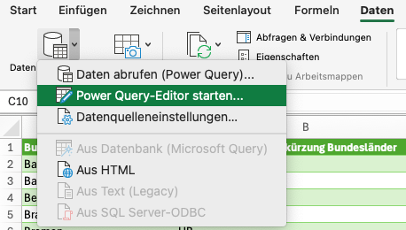

# SearchKit + Excel / Google Sheets

_**SearchKit Suchergebnisse über die API in Excel oder Google Sheets laden - Datenvisualisierung und weitere Auswertung dort.**_

[💾 daten-organisieren](./../1-datenlebenszyklus.html#daten-organisieren): CiviCRM Datenbank  
[🔢 daten-auswerten](./../1-datenlebenszyklus.html#daten-auswerten): [SearchKit](./../3-tools/1-civicrm_intern/4-civicrm-searchkit-chartkit.md#searchkit)  
[📊 daten-visualisieren](./../1-datenlebenszyklus.html#daten-visualisieren): [Excel](./../3-tools/2-tabellenkalkulation.md#microsoft-excel) bzw. [Google Sheets](./../3-tools/2-tabellenkalkulation.md#google-sheets)  
[⚙️ daten-verbinden](./../1-datenlebenszyklus.html#daten-verbinden): [Power Query](./../3-tools/2-tabellenkalkulation.md#power-query) bzw. [Google Apps Script](./../3-tools/2-tabellenkalkulation.md#google-apps-script)

## SearchKit, Excel und Power Query

### Voraussetzungen

- CiviCRM API Schlüssel, um auf die folgenden Endpunkte der CiviCRM API eurer Instanz zuzugreifen:
    - `ajax/api4/SavedSearch/get`
    - `ajax/api4/SearchDisplay/download`
- Lizenz für *Microsoft Excel Desktop Version*[^note-powerquery], optional für *Excel für das Web*

Bei diesem Ansatz hinterlegt ihr euren API-Schlüssel in einer Excel-Datei. Alle Personen, die diese Datei öffnen, können somit auf euren API-Schlüssel und somit auf die Daten zugreifen, auf die ihr in CiviCRM Zugriff habt. Seid euch der Risiken bewusst und geht verantwortungsvoll mit entstandenen Dateien zu.

[^note-powerquery]: Für die Einrichtung und Konfiguration ist die Desktop Version von Excel notwendig. Das Abrufen der Daten funktioniert dann auch unter Excel für das Web, wenn man die Datei hochgeladen hat. Der Ansatz wurde getestet unter Microsoft Excel for Mac, Version 16.100.3 unter der Lizenz Microsoft 365.

### Anleitung

#### Setup

1. Ladet die `test-excel.xlsx` Datei aus dem [GitHub Repository](https://github.com/CorrelAid/cdl_civicrm_analyse/blob/main/supporting_code/powerquery/test-excel.xlsx) herunter. Dazu oben rechts auf die drei Punkte und dann auf "Download" bzw. "Herunterladen" klicken.
2. Öffnet die Datei in der Desktop Version von Microsoft Excel. 
3. Aktiviert die externen Datenverbindungen, indem ihr auf "Inhalt aktivieren" klickt.

4. Öffnet den Power Query Editor über den Ribbon Daten -> Daten abfragen (Power Query) -> Power Query-Editor starten.

5. In der Seitenleiste links wählt den Eintrag `CiviToken`. Gebt euren API Schlüssel für die CiviCRM API ein. Klicke auf "Übernehmen".

#### Eigene SearchKit-Suchen herunterladen

Im **Power Query Editor** ist die **Funktion `getSavedSearch`** (dt. "bekomme gespeicherte Suche") hinterlegt. Mit dieser Funktion könnt ihr eigene SearchKit Suchen abfragen.

1. In der linken Seitenleiste -> fx `getSavedSearch` 
2. in das Feld "SearchName" den Namen eurer SearchKit Suche eingeben. Wichtig: **Leerzeichen müsst ihr mit Unterstrichen ersetzen**. z.B. wird "geschlecht statistik" zu "geschlecht_statistik" oder "Zuwendungen nach Zahlungsmethode" zu "Zuwendungen_nach_Zahlungsmethode". **auf "Aufrufen" klicken**.

3. dies legt einen neuen Query in der Seitenleiste an und führt ihn direkt aus. Ihr könnt dem Query mit Rechtsklick einen aussagekräftigeren Namen geben. 
4. Wenn ihr ganz normal auf den Query in der Seitenleiste klickt, solltet ihr das Ergebnis eurer SearchKit Suche als Tabelle sehen. 

5. Sehr ihr anstatt dessen eine Warnung oder einen Fehler, ist etwas schief gelaufen. Überprüft, ob ihr die richtigen Zugriffsrechte habt und ob ihr den API Schlüssel bei Setup richtig hinterlegt habt.
6. Um in Excel gut weiterarbeiten zu können, müsst ihr noch **sicherstellen, dass die Daten den richtigen Typ** haben. Das ist v.a. wichtig für Zahlenwerte wie Anzahl, Mittelwert, usw. Hierzu in der Vorschautabelle im Power Query Editor Rechtsklick auf den Spaltennamen -> Änderungstyp. Dann den gewünschten Datentyp auswählen.

7. Schließt den Power Query Editor mit dem Button **Schließen und Laden**. Dies **legt ein neues Tabellenblatt für die neuen Queries an und fügt die Ergebnistabellen dort ein**.
8. Ihr könnt jetzt die Tabelle markieren mit den Daten weiterarbeiten: z.B. ein Diagramm (Einfügen -> Diagramm auswählen) oder eine Pivot-Tabelle (Einfügen -> PivotTable) einfügen.

**Tipp**: auf Windows könnt ihr noch genauer kontrollieren, wie und wo ihr eure Power Queries verwenden wollt. Auf Youtube gibt es viele Videos zu Power Query, die mit der Windows Version arbeiten und euch zeigen, was ihr noch so machen könnt.

#### Power Queries aktualisieren und bearbeiten

Über Ribbon Daten -> Alle Aktualisieren könnt ihr eure **Power-Query-Abfragen aktualisieren**. **Verbundene Diagramme, Pivot-Tabellen und sonstige Auswertungen aktualisieren sich automatisch**.

Falls ihr die Funktion bearbeiten möchtet, könnt ihr dies über Rechtsklick auf `getSavedSearch` -> Erweiterter Editor tun. Den Code für die Funktion sowie einen Power Query, der euch eine Liste aller SearchKit Suchen zurückgibt, haben wir auch im [GitHub Repository](https://github.com/CorrelAid/cdl_civicrm_analyse/tree/main/supporting_code/powerquery) hinterlegt.

#### Power Query in der Cloud
Power Query wird in Excel für das Web nur eingeschränkt unterstützt. Es gibt keinen Power Query Editor, aber bestehende Queries funktionieren und es gibt den "Alle aktualisieren" Button. Verwendet ihr Excel in der Cloud, kann ein\*e Kolleg\*in die Queries anlegen und dann die Excel-Datei in die Cloud laden.

## SearchKit, Google Sheets und Google Apps Script

_todo_
