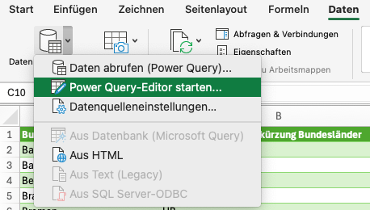
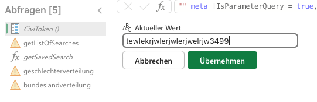
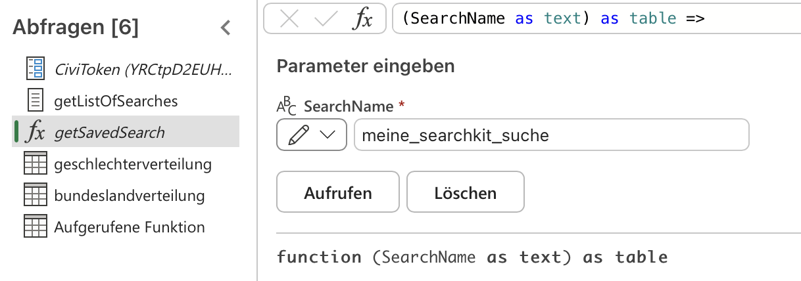
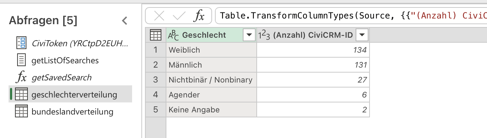
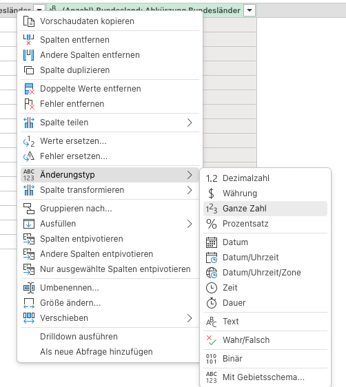
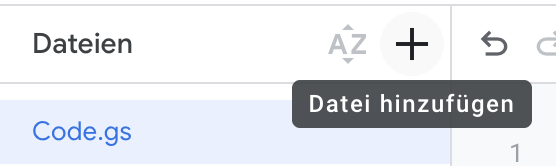

# SearchKit & Excel / Google Sheets

_**SearchKit Suchergebnisse über die API in Excel oder Google Sheets laden - Datenvisualisierung und weitere Auswertung dort.**_

[💾 daten-organisieren](./../2-datenlebenszyklus.md#daten-organisieren): CiviCRM Datenbank <br>
[🔢 daten-auswerten](./../2-datenlebenszyklus.md#daten-auswerten): [SearchKit](./../4-tools/1-civicrm_intern/4-civicrm-searchkit-chartkit.md#searchkit) <br>
[📊 daten-visualisieren](./../2-datenlebenszyklus.md#daten-visualisieren): [Excel](./../4-tools/2-tabellenkalkulation.md#microsoft-excel) bzw. [Google Sheets](./../4-tools/2-tabellenkalkulation.md#google-sheets) <br>
[⚙️ daten-verbinden](./../2-datenlebenszyklus.md#daten-verbinden): [Power Query](./../4-tools/2-tabellenkalkulation.md#power-query) bzw. [Google Apps Script](./../4-tools/2-tabellenkalkulation.md#google-apps-script)

# SearchKit, Excel und Power Query

## Voraussetzungen


- CiviCRM API Schlüssel, um auf die folgenden Endpunkte der CiviCRM API eurer Instanz zuzugreifen:
    - `ajax/api4/SavedSearch/get`
    - `ajax/api4/SearchDisplay/download`
- Lizenz für *Microsoft Excel Desktop Version*[^note-powerquery], optional für *Excel für das Web*

```admonish warning title="Mit API-Schlüssel vorsichtig umgehen"
Bei diesem Ansatz hinterlegt ihr euren API-Schlüssel in einer Excel-Datei. Alle Personen, die diese Datei öffnen, können somit auf euren API-Schlüssel und somit auf die Daten zugreifen, auf die ihr in CiviCRM Zugriff habt. Seid euch der Risiken bewusst und geht verantwortungsvoll mit entstandenen Dateien um.

```

[^note-powerquery]: Für die Einrichtung und Konfiguration ist die Desktop Version von Excel notwendig. Das Abrufen der Daten funktioniert dann auch unter Excel für das Web, wenn man die Datei hochgeladen hat. Der Ansatz wurde getestet unter Microsoft Excel for Mac, Version 16.100.3 unter der Lizenz Microsoft 365.

## Anleitung

### A. Setup

1. Ladet die `test-excel.xlsx` Datei aus dem [GitHub Repository](https://github.com/CorrelAid/cdl_civicrm_analyse/blob/main/supporting_code/powerquery/test-excel.xlsx) herunter. Dazu oben rechts auf die drei Punkte und dann auf "Download" bzw. "Herunterladen" klicken.
2. Öffnet die Datei in der Desktop Version von Microsoft Excel. 
3. Aktiviert die externen Datenverbindungen, indem ihr auf "Inhalt aktivieren" klickt.


4. Öffnet den Power Query Editor über den Ribbon Daten -> Daten abfragen (Power Query) -> Power Query-Editor starten.



5. In der Seitenleiste links wählt den Eintrag `CiviToken`. Gebt euren API Schlüssel für die CiviCRM API ein. Klicke auf "Übernehmen".



### B. Eigene SearchKit-Suchen herunterladen

Im **Power Query Editor** ist die **Funktion `getSavedSearch`** (dt. "bekomme gespeicherte Suche") hinterlegt. Mit dieser Funktion könnt ihr eigene SearchKit Suchen abfragen.

1. In der linken Seitenleiste -> fx `getSavedSearch` 
2. in das Feld "SearchName" den Namen eurer SearchKit Suche eingeben. Wichtig: **Leerzeichen müsst ihr mit Unterstrichen ersetzen**. z.B. wird "geschlecht statistik" zu "geschlecht_statistik" oder "Zuwendungen nach Zahlungsmethode" zu "Zuwendungen_nach_Zahlungsmethode". **auf "Aufrufen" klicken**.


3. dies legt einen neuen Query in der Seitenleiste an und führt ihn direkt aus. Ihr könnt dem Query mit Rechtsklick einen aussagekräftigeren Namen geben. 
4. Wenn ihr ganz normal auf den Query in der Seitenleiste klickt, solltet ihr das Ergebnis eurer SearchKit Suche als Tabelle sehen. 

5. Sehr ihr anstatt dessen eine Warnung oder einen Fehler, ist etwas schief gelaufen. Überprüft, ob ihr die richtigen Zugriffsrechte habt und ob ihr den API Schlüssel bei Setup richtig hinterlegt habt.
6. Um in Excel gut weiterarbeiten zu können, müsst ihr noch **sicherstellen, dass die Daten den richtigen Typ** haben. Das ist v.a. wichtig für Zahlenwerte wie Anzahl, Mittelwert, usw. Hierzu in der Vorschautabelle im Power Query Editor Rechtsklick auf den Spaltennamen -> Änderungstyp. Dann den gewünschten Datentyp auswählen.



7. Schließt den Power Query Editor mit dem Button **Schließen und Laden**. Dies **legt ein neues Tabellenblatt für die neuen Queries an und fügt die Ergebnistabellen dort ein**.
8. Ihr könnt jetzt die Tabelle markieren mit den Daten weiterarbeiten: z.B. ein Diagramm (Einfügen -> Diagramm auswählen) oder eine Pivot-Tabelle (Einfügen -> PivotTable) einfügen.


**Tipp**: auf Windows könnt ihr noch genauer kontrollieren, wie und wo ihr eure Power Queries verwenden wollt. Auf Youtube gibt es viele Videos zu Power Query, die mit der Windows Version arbeiten und euch zeigen, was ihr noch so machen könnt.


### C. Power Queries aktualisieren und bearbeiten

Über Ribbon Daten -> Alle Aktualisieren könnt ihr eure **Power-Query-Abfragen aktualisieren**. **Verbundene Diagramme, Pivot-Tabellen und sonstige Auswertungen aktualisieren sich automatisch**.

Falls ihr die Funktion bearbeiten möchtet, könnt ihr dies über Rechtsklick auf `getSavedSearch` -> Erweiterter Editor tun. Den Code für die Funktion sowie einen Power Query, der euch eine Liste aller SearchKit Suchen zurückgibt, haben wir auch im [GitHub Repository](https://github.com/CorrelAid/cdl_civicrm_analyse/tree/main/supporting_code/powerquery) hinterlegt.


```admonish question title="Funktioniert das auch in der Microsoft Cloud?"
Power Query wird in Excel für das Web nur eingeschränkt unterstützt. Es gibt keinen Power Query Editor, aber bestehende Queries funktionieren und es gibt den "Alle aktualisieren" Button. Verwendet ihr Excel in der Cloud, kann ein\*e Kolleg\*in die Queries anlegen und dann die Excel-Datei in die Cloud laden.
```

# SearchKit, Google Sheets und Google Apps Script

## Voraussetzungen

- CiviCRM API Schlüssel, um auf die folgenden Endpunkte der CiviCRM API eurer Instanz zuzugreifen:
    - `ajax/api4/SavedSearch/get`
    - `ajax/api4/SearchDisplay/download`
- Google Konto[^note-google]

```admonish warning title="Mit API-Schlüssel vorsichtig umgehen"
Bei diesem Ansatz hinterlegt ihr euren API-Schlüssel in einem Google Apps Script. Alle Personen, die Mitarbeiter-Zugriff (en: Editor) auf das Google Sheet haben, können auf den Apps Script Editor und somit auf euren API-Schlüssel und alle Daten zugreifen, auf die ihr in CiviCRM Zugriff habt. Seid euch der Risiken bewusst und geht verantwortungsvoll mit Zugriffsrechten um.

```

[^note-google]: Wir haben den Ansatz mit einem Google Account getestet aus unserem [Google Workspace for Nonprofits](https://www.google.com/nonprofits/offerings/workspace/). Theoretisch sollte es aber auch mit einem kostenlosen, privaten Google Account funktionieren.

## Anleitung


### A. Setup

#### Schneller Setup
1. Erstellt eine Kopie dieses [Google Sheets](https://docs.google.com/spreadsheets/d/1KOru4DDJRK9KSCHCSNt3m9SYxvppOjYuBZpzrw1MyG0/edit?pli=1&gid=1127353823#gid=1127353823): Datei -> Kopie erstellen. 
2. Ihr bekommt eine Warnung, dass eine Apps Script-Datei ebenfalls kopiert werden. Ihr könnt den Code erst überprüfen, bevor ihr eine Kopie erstellt. 
3. Öffnet das erstellte Google Sheet und öffnet die **Google Apps Script Konsole** über Erweiterungen -> Apps Script. Ein neues Fenster öffnet sich mit der Datei `runAllSearches.gs` geöffnet.

```admonish question title="Was ist das für Code?"

Der Code ist auf zwei `.gs`-Dateien[^footnote-gs] aufgeteilt:

1. `runAllSearches.gs`: hier gebt ihr euren API-Schlüssel ein und verwendet die Funktion `fetchSavedSearch`, um Ergebnisse einer oder mehrerer SearchKit-Suche(n) mithilfe CiviCRM-API in das Google Sheet zu importieren.
2. `fetchSavedSearch.gs`: enthält die Funktion `fetchSavedSearch`

Den Code findet ihr auch im [GitHub Repository](https://github.com/CorrelAid/cdl_civicrm_analyse/supporting-code/google-apps-script).

```

[^footnote-gs]: `gs` steht für **G**oogle Apps **S**cript. Technisch gesehen ist Google Apps Script eine Version von JavaScript.
Was ist hier drin?

#### Manueller Setup

1. Erstellt ein leeres Google Sheet und gebt ihm einen sinnvollen Namen (z.B. "CiviCRM API Test")
2. Öffnet Google Apps Script (Erweiterungen -> Apps Script). Es öffnet sich ein Editor. 
3. Benennt die Datei `Code.gs` um in `runAllSearches` (drei Punkte rechts neben Namen -> Umbenennen) und drückt Enter.
4. Löscht den Beispielcode und kopiert den [Code der Datei `runAllSearches.js`](https://github.com/CorrelAid/cdl_civicrm_analyse/blob/main/supporting_code/google-apps-script/runAllSearches.js) in das Editorfenster. Speichert mithilfe von `STRG/CMD+S` oder dem Diskettensymbol.
5. Erstellt eine neue Script-Datei im Apps Script Editor: + Zeichen bei Datei -> Script



5. Löscht den Beispielcode und kopiert den [Code der Datei `fetchSavedSearch.js`](https://github.com/CorrelAid/cdl_civicrm_analyse/blob/main/supporting_code/google-apps-script/fetchSavedSearch.js) in das Editorfenster. Speichert mithilfe von `STRG/CMD+S` oder dem Diskettensymbol.

### B. Apps Script laufen lassen

Um den Code laufen zu lassen, drückt ihr auf den Button "Ausführen" (en: "Run") (**nicht**: "Bereitstellen"!), wenn ihr `runAllSearches.gs` geöffnet hat. 

Wenn ihr dies zum ersten Mal tut, werdet ihr dazu aufgefordert, dem **Skript Berechtigungen** zu geben. Dies müsst ihr tun, damit das Skript auf die CiviCRM-API zugreifen kann und die Daten in das Google Sheet schreiben kann. Wenn ihr Google Chrome verwendet, folgen weitere Warnungen, da es sich nicht um eine "verifizierte App" handelt.


```admonish question title="Mich verunsichern die Warnungen ... ist das nicht gefährlich?"
Die Berechtigungen gelten nur für eure eigene Kopie der App. Diese habt ihr erstellt, ...
- ... indem ihr das von uns bereitgestellte Google Sheet mit dem dazugehörigen Apps Script Code *kopiert* habt ("schneller Setup"). Wir haben auf eure *Kopie* des Google Sheets **keinen Zugriff**.
- ... indem ihr eine *eigenes* Google Sheet plus eigenem Apps Script Code erstellt habt ("manueller Setup"). Wir haben auf euer Google Sheet und auch den Code **keinen Zugriff**.  

Trotzdem solltet ihr Code, den ihr von anderen übernehmt, immer sorgfältig prüfen. Hier können euch LLMs oder ein Blick durch Expert*innen weiterhelfen.
```

### C. Eure eigenen Suchen abrufen
1. Öffnet das erstellte Google Sheet und öffnet die Google Apps Script Konsole über Erweiterungen -> Apps Script. Ein neues Fenster öffnet sich mit der Datei `runAllSearches.gs` geöffnet.
2. Ergänzt in Zeile 2 euren API-Schlüssel zwischen den "". 

```js
function runAllSearches() {
  var apiKey = "hier euer API-Schlüssel"; // Replace with your actual API key within the "", e.g. "b2391932kss"

 // @param {string} searchName - The name of the saved search in CiviCRM.
 // @param {string} sheetName - The name of the sheet in the Google Spreadsheet where data should be written. Does not need to exist when executed
 // @param {string} apiKey - Your CiviCRM API key.

  fetchSavedSearch("der Name eurer SearchKit Suche", "Name des Google Sheet Blattes", apiKey);

  // ihr könnt noch mehr Suchen in anderen Blättern abrufen
  fetchSavedSearch("der Name eurer SearchKit Suche", "Name eines weiteren Google Sheet Blattes", apiKey);
}
```


https://developers.google.com/apps-script/guides/triggers/installable?hl=de