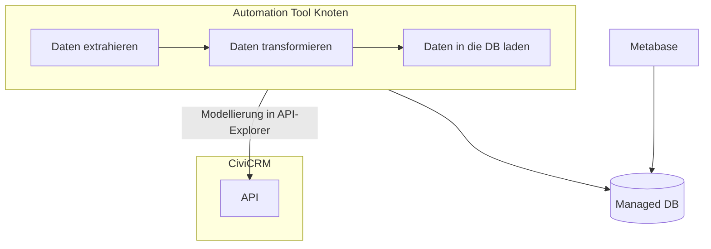

# ETL: CiviCRM API, Automation, Managed DB & Metabase

<br>


<br>

In diesem Unterkapitel werden Tool-Kombinationen vorgestellt, mit denen sich **ETL-Prozesse (Extract, Transform & Load)** umsetzen lassen. Über eine API extrahieren wir Daten aus CiviCRM, um sie dann zu verarbeiten und schließlich in eine externe Datenbank zu laden. 

Die externe Datenbank dient als **Data Warehouse**. Die Prozesse werden ausgeführt von einem [Workflow Automation Tool](../../4-tools/5-workflow-tools.md), das hier für **Data Orchestration** eingesetzt wird. Zusätzlich schließen wir [Metabase](../../4-tools/3-bi-tools.md#Metabase) an die externe Datenbank an, um die Daten visualisieren zu können. 

```admonish question title="Warum benötigen wir eine externe Datenbank?"
Zum einen ist der Betrieb von CiviCRM abhängig von einer Datenbank (Anwendungsdatenbank). Wenn wir nun Anfragen auf dieser Datenbank laufen lassen, könnte das für Nutzer:innen zu längeren Wartezeiten oder gar Ausfällen führen. Zum anderen ist der Sinn von einem klassischen Data Warehouse Daten aus verschiedenen Quellen für Analyse modelliert und transformiert zu speichern, was bei der Anwendungsdatenbank nicht unbedingt der Fall sein muss. Außerdem haben Data Warehouses andere Betriebsanforderungen.
```

```admonish tldr title="ETL & Relational Data Warehouse"
Die vorgestellten Ansätze sind eine reduzierte Form von ETL und unterscheiden sich in verschiedenen Hinsichten von üblichen Vorgehensweisen. Die wichtigsten Transformationsschritte die wir durchführen, werden über die API abgebildet. Oft wird dafür ein spezielles Tool wie [dbt](https://www.getdbt.com/product/what-is-dbt) genutzt. 

Unsere managed Datenbank, die selbst relational ist, nutzen wir als **Relational Data Warehouse**. Dies bedeutet, das wir die Daten in einer bestimmten strukturierten Form speichern und abfragen können. Alternativen dazu sind Warehouse-Architekturen wie Data Lakes, wo Daten in weniger strukturierter Form gespeichert werden. 

Eine gute Erklärung dieser Begriffe findet ihr in [diesem](https://www.youtube.com/watch?v=FgnzgRD3Gfk) Video.
```

Dieser ETL-Ansatz wird anhand von zwei Use Cases veranschaulicht, bei denen jeweils eines der zwei ausgewählten Workflow Automation Tools verwendet wird. Zuerst erklären wir, wie man mit [n8n](../../4-tools/5-workflow-tools.html#n8n) durch das Duplizieren eines Datenausschnitts die Datengrundlage für die Visualisierung einfacher deskriptive Statistiken schaffen kann.

Danach wird der komplexere Use-Case der Visualisierung von Spender:innenwanderungen thematisiert. Nachdem notwendige Daten über einen API-Request aggregiert wurden, geschieht dies mithilfe von [Kestra](../../4-tools/5-workflow-tools.html#kestra).

