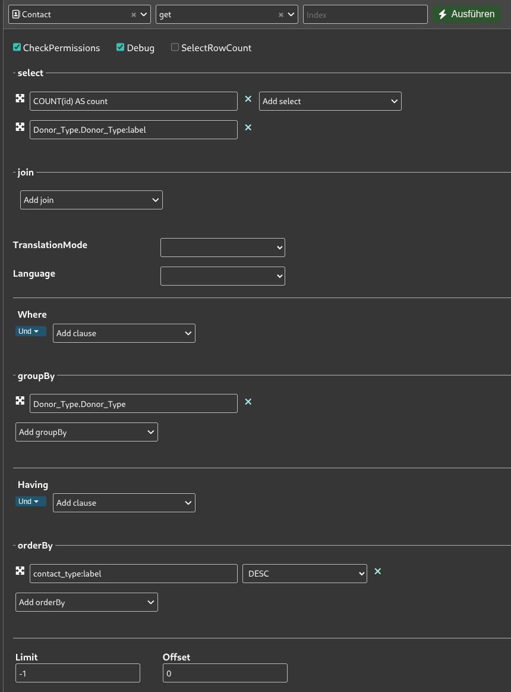

# ETL mit Kestra - Spender:innenwanderungen über die Zeit

**Wir orchestrieren einen ETL-Prozess (Extract, Transform & Load) mit Kestra um die Frage zu beantworten, wie sich Spender:innentypen über die Zeit entwickeln. Dazu aggregieren wir Daten über die CiviCRM API und laden sie täglich in eine Datenbank, um die Entwicklung mit einem Line-Chart zu visualisieren.**

[💾 daten-organisieren](./../../2-datenlebenszyklus.md#daten-organisieren): [CiviCRM API Explorer](./../../4-tools/1-civicrm_intern/3-civicrm-api.md#api-explorer) & [Neon](./../../4-tools/4-managed-datenbank.md#neon)<br>
[🔢 daten-auswerten](./../../2-datenlebenszyklus.md#daten-auswerten): [Metabase](./../../4-tools/3-bi-tools.md#metabase) <br>
[📊 daten-visualisieren](./../../2-datenlebenszyklus.md#daten-visualisieren): [Metabase](./../../4-tools/3-bi-tools.md#metabase) <br>
[⚙️ daten-verbinden](./../../2-datenlebenszyklus.md#daten-verbinden):
[CiviCRM API](./../../4-tools/1-civicrm_intern/3-civicrm-api.md) & [Kestra](../../4-tools/5-workflow-tools.md#kestra)

## Voraussetzungen

- Account bei [Neon](./../../4-tools/4-managed-datenbank.md#anlegen-einer-datenbank-und-tabelle)
- [API-Token](./../../4-tools/1-civicrm_intern/3-civicrm-api.md#api-einrichten) für eine CiviCRM-Instanz
- Kestra-Instanz oder ein Abonnement des Kestra SaaS
- Metabase-Instanz oder ein Abonnement des Metabase SaaS
- Benutzerdefiniertes Datenfeld [Donor Type](../../4-tools/1-civicrm_intern/1-erweiterung-daten.md) in CiviCRM

## Anleitung

Dieser Ansatz besteht aus vier Komponenten, die wir nacheinander vorbereiten. 

### A: Erweiterung der CiviCRM Datenfelder

Wie [hier](../../4-tools/1-civicrm_intern/1-erweiterung-daten.md) beschrieben, benötigen wir ein neues **benutzerdefiniertes Datenfeld**, das den Typ einer spendenden Person erfasst. Für Demonstrationszwecke halten wir es simpel und legen das Feld **Donor Type** als **Auswahlliste** mit den Optionen **One Time Donor**, **Monthly Donor** und **Past Donor** an. Die Benennung ist dabei beliebig veränderbar und es könnten auch mehr Optionen genutzt werden.

```admonish info title="Integration in die Datenerfassung"
Für unseren Test erstellen wir programmatisch Testdaten mit diesem Datenfeld. In der Realität müsst ihr dieses neue Feld jedoch in eure Erfassung von Kontakten integrieren, oder die Information anderweitig erfassen. Eine Option ist zum Beispiel die Nutzung von **Gruppen** für Kontakte. Auf Englisch ist dies [hier](https://docs.civicrm.org/user/en/latest/organising-your-data/smart-groups) dokumentiert. Ihr könntet Gruppen mit Kriterien wie *ist zu einer Contribution zugeordnet* anlegen.
```

### B: Anlegen einer Tabelle in der Managed Datenbank (Neon)

#### Option 1: GUI

Erstelle eine neue Tabelle (wie [hier](../../4-tools/4-managed-datenbank.md#anlegen-einer-datenbank-und-tabelle) beschrieben):

- Gebe der Tabelle den Namen `spendende_typen_agg`
- Füge die Spalte `timestamp` mit dem Datentyp `timestamp` und dem Constraint `Not null` hinzu
- Füge für jeden Spender:innentyp eine Spalte hinzu (z.B. `nicht_spendend`, `einmalig`, `monatlich`, `ehemalig`)
- Wähle für diese Spalten den Datentyp `integer` und den Constraint `Not null` aus

```admonish tldr title="Constraints"
Constraints sind Regeln, die die Datenintegrität und -konsistenz gewährleisten, indem sie festlegen, welche Daten wie in Tabellen gespeichert werden dürfen. Sie dienen als Datenvalidierungsprüfungen auf Ebene der Datenbank.
```

#### Option 2: SQL-Editor

Die Tabelle lässt sich im SQL-Editor von Neon durch das Ausführen des folgenden Codes erstellen:

```sql
CREATE TABLE IF NOT EXISTS "spendende_typen_agg" (
  "id" integer PRIMARY KEY GENERATED ALWAYS AS IDENTITY (
    sequence name "spendende_typen_agg_id_seq"
  ),
  "timestamp" timestamp NOT NULL,
  "nicht_spendend" integer NOT NULL,
  "monatlich" integer NOT NULL,
  "einmalig" integer NOT NULL,
  "ehemalig" integer NOT NULL
);
```

```admonish question title="Wo finde ich mehr Beispiel-Code?"
Diesen und anderen SQL-Code findet ihr auch im [Repository](https://github.com/CorrelAid/cdl_civicrm_analyse) in dem Ordner `supporting_code/sql`.
```

### C: Datenmodellierung im API-Explorer von CiviCRM

Navigiert zum [API Explorer](../../4-tools/1-civicrm_intern/3-civicrm-api.md#api-explorer) und wählt als Entität `Contact`, sowie als Aktion `get` aus. Hier besteht die Datenmodellierung nun aus einer Aggregation nach dem Typ der spendenden Person.



Konfiguriert die API-Anfrage so wie in dem Screenshot oben:

1. Wählt unter **select** die Felder `COUNT(id) AS count` und `Donor_Type.Donor_Type:label` aus
2. Nutzt die **groupBy** Funktion, um die Reihen nach `Donor_Type.Donor_Type` zu gruppieren
3. Sortiert die Ergebnisse unter **orderBy** nach `contact_type:label` in absteigender Reihenfolge (`DESC`)

```admonish tldr title="Aggregation in der API"
Wir zählen die IDs pro Spenden-Typ und zeigen den Namen des Typs an. Die Sortierung ist wichtig, da wir später die Position in der Liste der Ergebnisse verwenden. Bei diesem Use Case erfolgt die Datenmodellierung hauptsächlich über die Aggregationsfunktionen der API.
```

Nach diesen Schritten könnt ihr bereits den Request Body weiter unten unter REST kopieren. Dies sollte in etwa so aussehen:

```
params=%7B%22select%22%3A%5B%22COUNT%28id%29%20AS%20count%22%2C%22Donor_Type.Donor_Type%3Alabel%22%5D%2C%22orderBy%22%3A%7B%22contact_type%3Alabel%22%3A%22DESC%22%7D%2C%22groupBy%22%3A%5B%22Donor_Type.Donor_Type%22%5D%7D
```

### D: Anlegen des Flows in Kestra

Erstellt einen neuen Workflow auf eurer Kestra-Instanz. Der vollständige Flow als YAML:

```yaml
id: civicrm_donor_type_count_polars
namespace: company.team
tasks:
  - id: request
    type: io.kestra.plugin.core.http.Request
    uri: http://civicrm.correlaid.org/civicrm/ajax/api4/Contact/get
    headers:
      X-Civi-Auth: "Bearer {{ secret('CIVICRM_API_TOKEN') }}"
    method: POST
    contentType: application/x-www-form-urlencoded
    body: |
      params=%7B%22select%22%3A%5B%22COUNT%28id%29%20AS%20count%22%2C%22Donor_Type.Donor_Type%3Alabel%22%5D%2C%22orderBy%22%3A%7B%22contact_type%3Alabel%22%3A%22DESC%22%7D%2C%22groupBy%22%3A%5B%22Donor_Type.Donor_Type%22%5D%7D
```

```admonish info title="Secrets in Kestra"
Wenn ihr Kestra selbst hostet, könnt ihr API Tokens etc. als [Secrets](https://kestra.io/docs/concepts/secret#secrets-in-the-open-source-version) anlegen.
```

```admonish question title="Diesen Flow importieren"
Den Flow als importierbare Datei findet ihr auch im [Repository](https://github.com/CorrelAid/cdl_civicrm_analyse) in dem Ordner `supporting_code/kestra_flows`
```

### E: Knoten für die API-Anfrage

Der erste Knoten enthält die **API-Anfrage**:

1. Fügt unter `uri` am Anfang die URL eurer Instanz ein. Im API Explorer unter dem Reiter **REST** ist dies auch als Variable `CRM_URL` definiert
2. Fügt euer API-Token als Secret ein (siehe oben)
3. Im Feld `body` fügt ihr den im API-Explorer generierten Body ein (siehe oben)

Ein Beispiel-Output der API-Anfrage ist:

```json
{
  "values": [
    {"count": 22, "Donor_Type.Donor_Type:label": null},
    {"count": 76, "Donor_Type.Donor_Type:label": "One Time Donor"},
    {"count": 117, "Donor_Type.Donor_Type:label": "Past Donor"},
    {"count": 91, "Donor_Type.Donor_Type:label": "Monthly Donor"}
  ],
  "entity": "Contact",
  "action": "get",
  "debug": null,
  "version": 4,
  "count": 4,
  "countFetched": 4
}
```

### F: Knoten für die Verarbeitung mit JSONata

[JSONata](https://jsonata.org/) ist eine Sprache für die Abfrage und Verarbeitung von JSON-Daten. In diesem Fall separieren wir die Zählungen der Typen durch folgende Anfrage:

```
$merge(
  $map(values, function($v) {
    {
      ($v."Donor_Type.Donor_Type:label" != null ? $v."Donor_Type.Donor_Type:label" : "Unlabeled"): $v.count
    }
  })
)
```

Die JSONata-Anfrage iteriert mit `$map` über das Array `values` und erzeugt für jeden Eintrag ein Objekt, dessen Schlüssel dynamisch aus `$v."Donor_Type.Donor_Type:label"` stammt oder, falls `null`, auf `Unlabeled` gesetzt wird. Der zugehörige Wert ist jeweils `$v.count`. Weil der Feldname Sonderzeichen enthält, wird er mit dem Pfad `."Donor_Type.Donor_Type:label"` in Anführungszeichen adressiert. Anschließend fasst `$merge` alle Einzelobjekte zu einem einzigen flachen Objekt zusammen, sodass die Spendentypen ihren Zählwerten zugeordnet sind.

Beispiel-Output:

```json
{
  "Unlabeled": 22,
  "One Time Donor": 76,
  "Past Donor": 117,
  "Monthly Donor": 91
}
```

### G: Knoten für das Laden der Daten in die Managed Datenbank

Dieser letzte Knoten ist für das Laden der Daten in die Managed Datenbank auf Neon, unser Data Warehouse, zuständig:

1. Legt zunächst Credentials für Postgres an. Die notwendigen Informationen findet ihr in der [Neon Konsole](https://neon.com/docs/connect/connect-from-any-app)
2. Konfiguriert den Knoten so, dass die transformierten Daten als neue Zeile mit dem aktuellen Timestamp in die Tabelle `spendende_typen_agg` eingefügt werden

```admonish tldr title="Daily Snapshot"
In den Begriffen des Data Engineering vollziehen wir hier einen regelmäßigen **Daily Snapshot**. Jeden Tag wird eine neue Zeile mit den aktuellen Zählungen der verschiedenen Spender:innentypen angelegt. So können wir die Entwicklung über die Zeit nachvollziehen.

Eine Alternative wäre ein **Full Load**, bei dem die gesamte Tabelle bei jeder Ausführung überschrieben wird. Der Snapshot-Ansatz erlaubt uns jedoch, historische Entwicklungen zu analysieren.
```

### H: Visualisierung in Metabase

1. Verbindet wie [hier](../../4-tools/3-bi-tools.md#mb-db-hinzufuegen) beschrieben die Datenbank mit Metabase. An die notwendigen Informationen kommt ihr ähnlich wie beim Anlegen der Postgres Credentials für den letzten Knoten des Workflows

2. Die Visualisierung ist ein **Line-Chart**, der die Entwicklung der verschiedenen Spender:innentypen über die Zeit darstellt. Nutzt die Spalte `timestamp` für die X-Achse und die verschiedenen Typen-Spalten für die Y-Achse

<br/>


