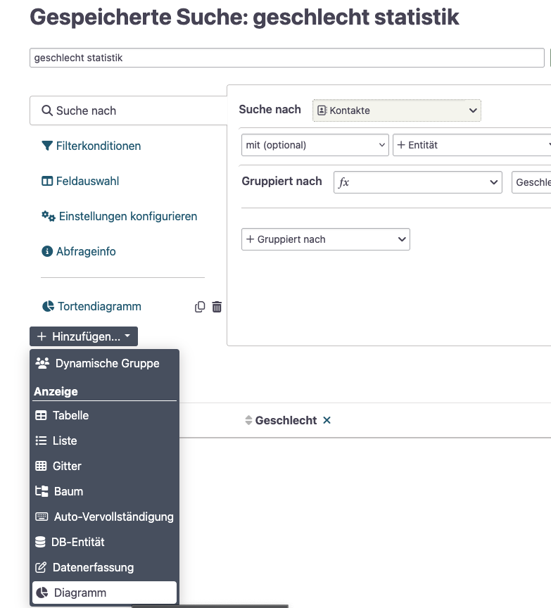

# CiviCRM SearchKit & ChartKit


## SearchKit
[🔢 daten-auswerten](./../../2-datenlebenszyklus.html#daten-auswerten)

CiviCRM [SearchKit](https://docs.civicrm.org/user/en/latest/searching/searchkit/what-is-searchkit/) ist eine Erweiterung für CiviCRM, die es Nutzer\*innen ermöglicht, komplexe Abfragen an ihre Daten zu stellen. Als Nutzer\*in kann man filtern, aggregieren, Felder auswählen und gruppieren. 


Wir arbeiten in unseren Beispielen mit einer einfachen Darstellung der Geschlechterverteilung. Diese Suche kann über SearchKit -> Import importiert werden.

```
[
  [
    "SavedSearch",
    "save",
    {
      "records": [
        {
          "name": "geschlecht_statistik",
          "label": "geschlecht statistik",
          "api_entity": "Contact",
          "api_params": {
            "version": 4,
            "select": [
              "COUNT(id) AS COUNT_id",
              "gender_id:label"
            ],
            "orderBy": [],
            "where": [
              [
                "gender_id:name",
                "IS NOT EMPTY"
              ]
            ],
            "groupBy": [
              "gender_id"
            ],
            "join": [],
            "having": []
          }
        }
      ],
      "match": [
        "name"
      ]
    }
  ]
]
```


#### Vorteile
- mächtiges Analysewerkzeug: ihr könnt verschiedene CiviCRM-Datentypen kombinieren, Einträge filtern, relevante Felder auswählen und Kennzahlen wie Anzahl, Mittelwerte, etc. (aggregiert) ausrechnen
- Zugriff auf Ergebnisse über die API: Ihr könnt Daten in SearchKit aggregieren und über die [API](./civicrm-api.md) in andere Tools einbinden. So habt ihr immer die aktuellen Ergebnisse eurer SearchKit-Suchen verfügbar und könnt mit ihnen weiterarbeiten.

#### Nachteile
- Das Arbeiten mit SearchKit erfordert eine Einarbeitung in datenorientiertes Denken. SearchKit orientiert sich stark an Konzepten von SQL[^note-sql], was für Personen, die sich nicht damit auskennen, erst einmal herausfordernd sein kann. 
- Das User Interface ist nicht immer intuitiv.


[^note-sql]: Eine [Erklärung des Begriffs "SQL"](https://civic-data.de/selbstlernmaterial/#sql) gibt es im Selbstlernmaterial des Civic Data Labs. 


#### Fazit
SearchKit erfordert etwas Einarbeitung, aber dann ist es eine gute und mächtige Option um innerhalb von CiviCRM Daten (deskriptiv) auszuwerten. 
Die Option, die Ergebnisse über die API abzurufen, eröffnet einen vielversprechenden Lösungsraum insb. für einfache deskriptive Auswertungen wie Output-Monitoring etc., in dem Daten in CiviCRM ausgewertet und aggregiert werden und in einem externen Tool visualisiert werden. Bei datenschutzsensibler und verantwortungsbewusster Aggregation der Daten in SearchKit können dann ggf. auch Tools von US-Anbietern zur Weiterverarbeitung verwendet werden, ohne den Datenschutz zu kompromittieren.


## ChartKit
[📊 daten-visualisieren](./../../2-datenlebenszyklus.html#daten-visualisieren)

Mit [ChartKit](https://lab.civicrm.org/extensions/chart_kit) kann man basierend auf SearchKit-Suchen einfache Grafiken wie Balken-, Linien- oder Tortendiagramme erstellen. 

1. Suche in SearchKit anlegen oder bearbeiten
2. im SearchKit Editor links Hinzufügen -> Diagramm
3. im ChartKit Editor können verschiedene Visualisierungstypen über ein grafisches User Interface konfiguriert werden. Verwendet werden können die Spalten der Ergebnisse der SearchKit Suche.




Für jede Suche können mehrere Visualisierungen erstellt werden.

Chart Kit sollte bei neueren Versionen von CiviCRM vorinstalliert sein. Sonst wendet euch an euren Hosting-Dienstleister.

#### Vorteile
- ChartKit ist direkt in SearchKit integriert und Visualisierungen sind direkt in CiviCRM gespeichert
- grafische Benutzeroberfläche ist relativ verständlich
- ausreichende Auswahl an Visualisierungen 
- ein Button zum Download als PNG oder SVG kann hinzugefügt werden -> praktisch
- wird aktiv weiterentwickelt (z.B. Talk beim [CiviCamp Hamburg 2024](https://systopia.de/blog/civicamp-hamburg-2024-retrospektive))

#### Nachteile
- man kann nicht alle Aspekte der Visualisierungen anpassen (z.B. Farben, bestimmte Marker, ...)
- Visualisierungen können nicht über einen Link mit Externen geteilt, in eine Website eingebettet oder über die API abgerufen werden.
- Visualisierungen sind "Anhängsel" von SearchKit Suchen und können nicht anders sortiert oder angeordnet werden. 

#### Fazit
Chart Kit ist eine gute Option, wenn ihr Datenvisualisierungen v.a. für den internen Gebrauch oder für Berichte ohne große Design-Anforderungen nutzen möchtet. Der Export-Button direkt in der Visualisierung ist sehr praktisch. In der Kombination mit SearchKit sind die Analyse- und Visualisierungsmöglichkeiten sehr umfassend - ihr könnt ChartKit Visualisierungen für alle in CiviCRM Daten erstellen. Es bestehen (noch) Einschränkungen bei der Verfeinerung der Visualisierungen sowie bei der Teilbarkeit aus CiviCRM hinaus. Wenn ihr ansprechendere oder komplexere Visualiserungen oder Dashboard-Funktionalitäten benötigt, solltet ihr daher auf externe Tools zurückgreifen. 


