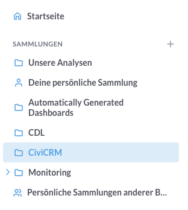
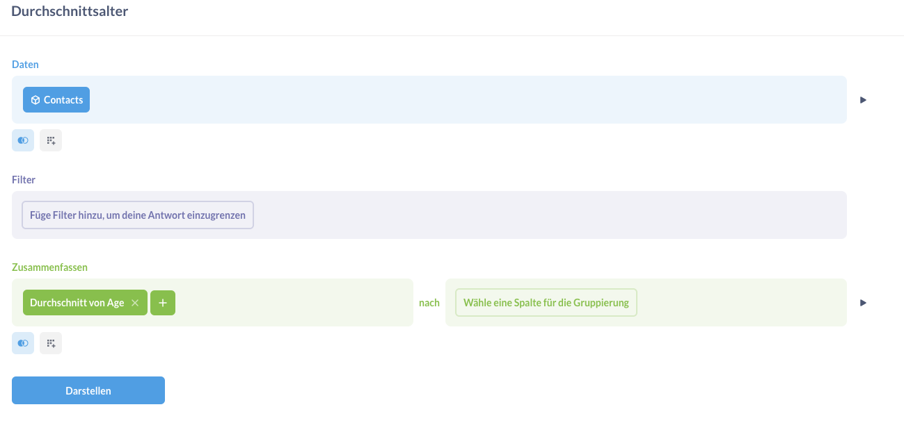
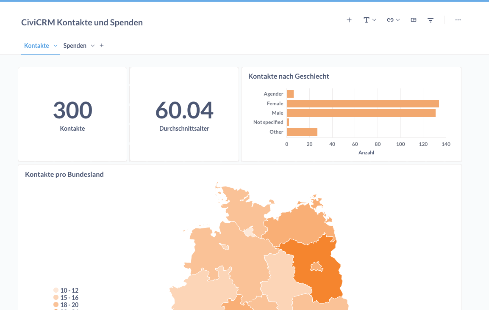
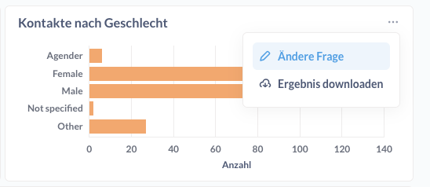

# Business Intelligence Tools 
[🔢 daten-auswerten](./../2-datenlebenszyklus.html#daten-auswerten)
[📊 daten-visualisieren](./../2-datenlebenszyklus.html#daten-visualisieren) 
[💬 daten-kommunizieren](./../2-datenlebenszyklus.html#daten-kommunizieren)

Business Intelligence Tools (BI-Tools) sind Softwarelösungen, die Organisationen dabei unterstützen, Daten zu sammeln, zu analysieren, zu visualisieren und in verwertbare Erkenntnisse umzuwandeln. Sie helfen, fundierte Entscheidungen zu treffen, indem sie komplexe Datenmengen verständlich und zugänglich machen.

## Metabase
[🔢 daten-auswerten](./../2-datenlebenszyklus.html#daten-auswerten)
[📊 daten-visualisieren](./../2-datenlebenszyklus.html#daten-visualisieren) 
[💬 daten-kommunizieren](./../2-datenlebenszyklus.html#daten-kommunizieren)

[Metabase](https://www.metabase.com) ist eine Open-Source-Software für Business Intelligence, die Organisationen dabei unterstützt, Daten zu analysieren und in interaktiven Dashboards zu visualisieren. Die Anwendung ermöglicht es Nutzer\*innen, auch ohne SQL-Kenntnisse Abfragen durchzuführen und Dashboards und Berichte zu erstellen. Metabase ist mit einer Vielzahl von Datenbanken kompatibel und richtet sich an Anwender\*innen, die Daten zugänglich und nutzbar machen möchten.

Man kann Metabase entweder selbst hosten, von einem IT-Dienstleister hosten lassen oder bestehende Hosting-Angebote nutzen:

- [Metabase Cloud](https://www.metabase.com/pricing/)
- [Elestio](https://elest.io/open-source/metabase])

#### Vorteile
- ermöglicht eigenständige Exploration von Daten
- zahlreiche Visualisierungstypen
- viele Optionen zur Kommunikation von Ergebnissen: automatsierte Email, Export als Bilddatei oder PDF, Teilen über öffentlichen Link, Einbettung von Dashboards und Grafiken in Website (wie hier)

<iframe width="100%" height="400px%" src="https://mtbs.correlaid.org/public/question/d0f6fa28-8270-4d51-afef-0e3218a4af94"></iframe>

#### Nachteile
- Kosten für Hosting relativ hoch
- in der Community Version können Farbpaletten nicht angepasst werden
- erfordert Einarbeitung und Auseinandersetzung mit Datenkonzepten wie z.B. "Joins" (Zusammenführen von Tabellen). 

#### Fazit 
Metabase (und andere BI Tools) sind sinnvoll, wenn ihr mittel- und langfristig eure Daten selbstbestimmt und eigenständig v.a. deskriptiv auswerten wollt. Mit Metabase (und jedem anderen BI Tool) werdet ihr selbst zu Datenanalyst*innen und könnt agil und nach Bedarf neue Visualisierungen und Dashboards anlegen. Komplexe Analysen wie Machine Learning oder KI könnt ihr im Bereich Business Intelligence nicht erwarten. Dafür gibt es nützliche Features, um eure Daten und Datenvisualisierungen mit externen Stakeholdern zu teilen, z.B. über Einbettungen oder öffentliche Links.

Den Vorteilen von Metabase (bzw. BI Tools) stehen **nötige Investitionen in Kompetenzaufbau und Infrastruktur** gegenüber. Metabase ist ein großes Tool mit vielen Funktionen. 
Deshalb braucht es Zeit und die Bereitschaft, sich einzuarbeiten und dazuzulernen. Hinzu kommt, dass bestehende Hosting-Optionen nicht günstig sind und Self-Hosting ohne interne Kompetenzen nicht möglich ist. Die Zusammenarbeit mit bestehenden IT-Dienstleistern ist eine Möglichkeit, wird aber natürlich trotzdem etwas kosten.
 
Insgesamt ist das Investment in ein Business Intelligence Tool **nicht für alle CiviCRM-Organisationen notwendig**. Es ist aber **sehr sinnvoll, wenn Daten perspektivisch für euch eine zentrale Rolle** spielen werden.

### Anleitung: Eine Datenbankverbindung in Metabase hinzufügen {#mb-db-hinzufuegen}

Damit Metabase auf die Daten aus eurer Datenbank (z.B. [CiviCRM Datenbank](./civicrm_intern/2-civicrm-datenbank.md) oder eine [Managed Datenbank](./managed-datenbank.md)) zugreifen kann, müsst ihr eine Verbindung zur Datenbank in Metabase hinzufügen.

1. Als Admin in Metabase einloggen.  
2. Oben rechts auf das **Zahnrad** → **Admin settings** klicken.  
3. **Databases** wählen → **Add a database**.  
4. Datenbank-Typ auswählen (z. B. Postgres, MySQL, SQL Server …).  
5. Verbindungsdaten eintragen:  
   - Name 
   - Host / IP 
   - Port 
   - Datenbankname  
   - Benutzer  
   - Passwort  
   - ggf. Connection-String  
6. Optional: **SSL** oder **SSH-Tunnel** aktivieren, falls nötig.  
7. **Save changes** (Metabase testet die Verbindung).  
8. Danach: **Sync database schema** und ggf. **Re-scan** ausführen, damit Tabellen/Spalten sichtbar sind.  
9. Falls Probleme auftreten: Netzwerk/Firewall, Port, DB-Zugriffsrechte und Metabase-Logs prüfen.

In [diesem YouTube Video](https://www.youtube.com/watch?v=P6DFuwqSDmQ) könnt ihr mitverfolgen, wie die Schritte sind. Die [schriftliche Dokumentation](https://www.metabase.com/docs/latest/databases/connecting) kann auch hilfreich sein.

### Mini-Anleitung: Daten auswerten und visualisieren in Metabase  {#mb-daten-analysieren}
Um eure Daten in Metabase auszuwerten und zu visualisieren, stellt ihr **Fragen** (en: Questions) an eure Daten. Diese Fragen könnt ihr **Sammlungen** (en: Collections) oder **Dashboards** hinzufügen. 
Einen Überblick über die wichtigsten Metabase-Konzepte findet ihr [hier](https://www.metabase.com/learn/metabase-basics/overview/concepts) (auf Englisch).

#### Sammlungen
**Sammlungen** sind wie Ordner, in denen ihr eure Fragen und Dashboards sortieren könnt.

#### Fragen
Zentral für die Analyse und Visualisierung von Daten in Metabase sind **Fragen** (en: Questions). Fragen könnt ihr entweder über mit dem grafischen Query-Editor oder mit SQL "stellen". 
Wir empfehlen euch, den grafischen Editor zu verwenden. Konzeptionell ähnelt der Editor [SearchKit](./../4-tools/civicrm_intern/4-civicrm-searchkit-chartkit.md): Man kann **Datensätze zusammenfügen, Felder auswählen, Einträge filtern, Daten aggregieren und Kennzahlen auswählen**. 

1. Um eine neue Frage anzulegen, klickt oben rechts den "Neu" Button -> Frage.
2. Verwendet die Bedienelemente, um die Daten auszuwählen, zu filtern, ...
3. Ihr könnt die Pfeile rechts der Elemente verwenden, um eine Vorschau eurer Frage anzuzeigen.
4. Sobald ihr zufrieden seid mit den Daten eurer Frage, klickt auf "Darstellen". Das bringt euch zur Visualisierung eures Ergebnisses.
5. Metabase wählt eine passende Visualisierung aus. Ihr könnt eine andere Visualisierung wählen, in dem ihr unten links auf "Visualisierung" klickt und euch durch die Optionen klickt.

Über den Button "Editor" oben rechts könnt ihr **jederzeit zurück zum Editor zurückkehren** um eure Anfrage anzupassen.

Am Ende **speichert** ihr eure Frage. 

**Ressourcen**: Metabase hat umfassendes [Lernmaterial](https://www.metabase.com/learn/) auf der Website, z.B. eine [Einführung in "Questions"](https://www.metabase.com/learn/metabase-basics/getting-started/ask-a-question). 

#### Dashboards
In Dashboards könnt ihr eure Fragen zusammen darstellen. Ihr könnt Tabs erstellen,  Filter für das ganze Dashboard hinzufügen, Texte und Überschriften einfügen. Ihr könnt direkt neue Fragen in ein Dashboard hinzufügen.
Darüber hinaus bieten Metabase Dashboards noch nützliche eingebaute Funktionen wie "Drill-Downs", mit denen man einzelne Daten direkt im Dashboard eingehender explorieren kann.

Ein neues Dashboard erstellt ihr mithilfe des **blauen "Neu" Buttons oben rechts**. 

Eine Einführung zu Dashboards (in Englisch) findet ihr [hier](https://www.metabase.com/docs/latest/dashboards/introduction). Tiefergehende Tutorials sind im [Learn-Bereich](https://www.metabase.com/learn/metabase-basics/querying-and-dashboards/#dashboards) zu finden. 

**Tipp:** Wenn ihr **Fragen** in der Dashboard-Ansicht ändern möchtet (z.B. weil ihr vergessen habt, zu filtern), dann geht das nur, wenn ihr den Dashboard-Editor-Modus über "Speichern" verlasst. Dann könnt ihr die einzelnen Fragen/Visualisierungen über das drei Punkte Dropdown -> Ändere Frage anpassen (siehe Screenshot). 

### Daten organisieren in Metabase
Wenn ihr feststellt, dass ihr bei der Erstellung von **Fragen** immer die gleichen Daten zusammenführt, filtert oder berechnet, dann sind die Funktionen Modelle und Metriken einen Blick wert. **Modelle sind abgeleitete Tabellen** bzw. gespeicherte Fragen, die Daten kuratieren und als Ausgangspunkt für neue Analysen dienen können. Wir haben z.B. ein Modell für "Kontakte" erstellt, welches die Geschlechtsoptionen schon an die Grundtabelle anspielt. So sparen wir uns diesen Schritt bei weiteren Fragen. Mit **Metriken** erstellt ihr eure **Aggregationen nur einmal**, speichert sie ab und könnt sie dann immer verwenden. 

## Alternativen: Apache Superset, Power BI und Tableau

[🔢 daten-auswerten](./../2-datenlebenszyklus.html#daten-auswerten)
[📊 daten-visualisieren](./../2-datenlebenszyklus.html#daten-visualisieren) 
[💬 daten-kommunizieren](./../2-datenlebenszyklus.html#daten-kommunizieren)

Alternativen zu Metabase sind u.a.:

- [Apache Superset](https://superset.apache.org/): komplett Open Source
- [Power BI](https://www.microsoft.com/de-de/power-platform/products/power-bi?market=de): Business Intelligence Tool in der Microsoft Umgebung
- [Tableau](https://www.tableau.com/): etabliertes BI-Tool aus den USA. Kann auch selbst gehostet werden (Lizenz muss trotzdem erworben werden).
- [Looker](https://lookerstudio.google.com/u/0/): BI Tool in der Google Umgebung

