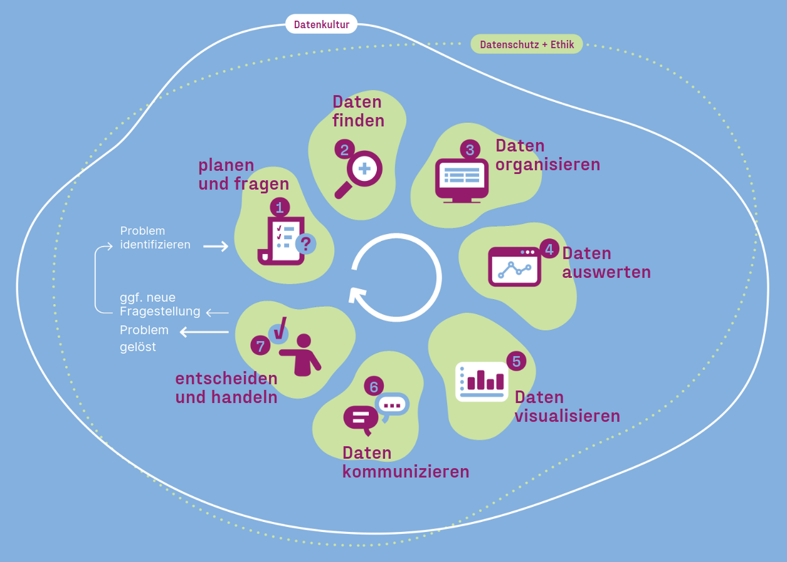

# CiviCRM Daten im Datenlebenszyklus

<figure style="margin: 0">

  
  <figcaption><small>Grafik "Datenlebenszyklus blau", ursprünglich von Gesellschaft für Informatik e.V. (2024), zugeschnitten von CorrelAid e.V., ist lizenziert unter <a href="https://creativecommons.org/licenses/by/4.0/deed.de">CC BY 4.0</a>.</small></figcaption>
  

</figure>

Der Datenlebenszyklus, visualisiert in der obigen Grafik, gibt einen Überblick über den Ablauf einer Datenanalyse - von der Planung bis hin zur Umsetzung. Wir werden dieses Konzept hier nicht genauer erklären. Deswegen empfiehlt es sich, bei Bedarf und Interesse die entsprechende [Informationsseite]([Datenlebenszyklus](https://civic-data.de/datenlebenszyklus/)) auf der CDL-Website zu lesen.

Wir verwenden den Datenlebenszyklus hier, um Komponenten und Tools den Schritten zuzuordnen und fokussieren uns dabei auf die folgenden Aspekte:

### Planen und fragen 🗺️ {#planen-und-fragen}
*Welche Fragen will ich mithilfe von Daten beantworten? Welche Daten brauche ich?**

Bei unserem Projekt gingen wir größenteils davon aus, dass interessierte Organisation schon Daten haben und auch wissen, welche Fragen sie an die Daten stellen wollen. Allerdings können manche Fragestellungen nur beantwortet werden, wenn man die in CiviCRM erfassten Daten erweitert. 

[Erweiterung von CiviCRM-Daten](./tools/civicrm_intern/1-erweiterung-datengrundlage.md)

### Daten organisieren 💾{#daten-organisieren}
*Wo und wie werden Daten gespeichert? Wie werden sie verwaltet und wie werden sie bereinigt?*

&rarr; Im Kontext unseres Datenvorhabens hat CiviCRM und seine [SQL-Datenbank](./tools/civicrm_intern/2-civicrm-datenbank.md) als Ort zur Speicherung und Verwaltung von Daten häufig ausgereicht. Trotzdem gibt es auch Fälle, wo zusätzliche Tools (z.B. eine [Managed Datenbank](./tools/managed-datenbank.md)) zur Organisation und Speicherung von CiviCRM-Daten sinnvoll waren, z.B. um [historische Daten verfügbar zu machen]() und so [Spenderübergänge zu analysieren]().

Dabei geht es nicht nur um den Speicherort: Wenn Daten langfristig gespeichert werden und auf deren Basis Analysen stattfinden sollen, lassen sich in diesem Schritt Methoden aus der Disziplin des Data Engineering anwenden. Dies umfasst unter anderem das Aggregieren oder das Kombinieren von Datensätzen. Manchmal muss man jedoch auch anfangen, zusätzliche Informationen zu erfassen, zum Beispiel, indem 

[💾 CiviCRM Datenbank](./tools/civicrm_intern/2-civicrm-datenbank.md) [💾 Managed Datenbank](./tools/managed-datenbank.md) 

### Daten auswerten 🔢  {#daten-auswerten}
*Wie werden Daten analysiert? Wie werden Ergebnisse analysiert?*

&rarr; CiviCRM Daten können unterschiedlich ausgewertet und analysiert werden: Von einfachen deskriptiven Analysen über tiefergehende Analysen hin zu komplexen Machine-Learning-Modellen zur Vorhersage von Spenden. Wir haben uns in unserer Arbeit überwiegend auf einfache Auswertungen fokussiert, da diese am übertragbarsten sind. 

[🔢 SearchKit]((./tools/civicrm_intern/4-civicrm-searchkit-chartkit.md#searchkit) [🔢 Excel](./tools/excel.md) [🔢 Google Sheets](./tools/google-workspace.md#google-sheets) [🔢 Metabase](./tools/bi-tools.md#metabase) [🔢 Python](./tools/python-und-r.md#python) [🔢 R](./tools/python-und-r.md#r) 

### Daten visualisieren 📊 {#daten-visualisieren}
*Wie werden Daten visuell ansprechend und passend für die Zielgruppe aufbereitet?*

&rarr; Viele Organisationen möchten ihre CiviCRM-Daten nicht nur auswerten, sondern auch in Datenvisualisierungen oder Dashboards aufbereiten. 

[📊 Excel](./tools/excel.md) [📊 Metabase](./tools/bi-tools.md#metabase) [📊 Power BI](./tools/bi-tools.md#power-bi) [📊 Apache Superset](./tools/bi-tools.md#superset) [📊 ChartKit](./tools/searchkit-chartkit.md#chartkit) [📊 Civisualize](./tools/civicrm-weitere-tools.md#civisualize) [📊 Google Sheets](./tools/google-workspace.md#google-sheets) 

### Daten kommunizieren 💬 {#daten-kommunizieren}
*Wie werden Ergebnisse zielgruppengerecht kommuniziert und geteilt?*

&rarr; Auswertungen von CiviCRM-Daten können unterschiedliche Zielgruppen haben: man selbst, die eigene Organisation bzw. das eigene Team, die breite Öffentlichkeit, existierende Fördermittelgeber oder potenzielle Sponsor\*innen. Je nach Zielgruppe(n) ergeben sich unterschiedliche Anforderungen an die Tiefe und Komplexität der Analyse, an das Design der Visualisierungen, an die Kommunikationswege.

Das Kommunizieren von Daten und Ergebnissen von Datenauswertungen ist eine Kunst bzw. ein Handwerk an sich[^note-datastorytelling]. Wir beschränken uns hier nur darauf, inwiefern Analyse- und Visualisierungs-Tools die Möglichkeiten bieten, Ergebnisse zu teilen, und inwiefern sie Ansprüche an Design und Professionalität erfüllen. Deshalb listen wir hier nicht separat "Datenkommunikationstools".

[^note-datastorytelling]: Das [E-Learning Datenvisualisierung und Storytelling](https://civic-data.de/bildungsangebote/e-learning-datenvisualisierung-und-storytelling/) des Civic Data Labs gibt einen guten Einstieg ins Thema. 

### Daten verbinden & Datenflüsse ermöglichen ⚙️ {#daten-verbinden}
*Wie werden Daten zusammengeführt? Wie werden Datenflüsse zwischen Tools ermöglicht?*

&rarr; Zusätzlich zu den Schritten des Datenlebenszyklus ist es bei unseren Experimenten sehr relevant gewesen, Komponenten und Tools miteinander zu integrieren, sie zu verbinden und Datenflüsse zu ermöglichen. Deshalb sprechen wir zusätzlich auch von *Daten verbinden & Datenflüsse ermöglichen*. 

[⚙️ CiviCRM-API](./tools/civicrm-api.md) [⚙️ Workflow Tools](./tools/workflow-tools.md) [⚙️ MS Power Query](./tools/excel.md#power-query) [⚙️ Google AppScript](./tools/google-workspace.md#google-appscript)

### Datenschutz
&rarr; Da in CiviCRM fast immer personenbezogene Daten gespeichert werden, bildet Datenschutz einen wichtigen Rahmen für die Auswertung von CiviCRM-Daten. Dies ist vor allem relevant, wenn Daten außerhalb von CiviCRM weiterverarbeitet werden. Wir haben bei unserer Arbeit darauf geachtet, Tools zu priorisieren, die Datensouveränität ermöglichen.

Trotzdem haben wir auch Software von außereuropäischen Anbietern in unsere Recherche miteinbezogen. Wenn ihr diese Tools nutzen möchtet, empfehlen wir euch, Daten in CiviCRM oder europäischen Umgebungen so weit zu aggregieren, dass kein Rückschluss mehr auf Individuen möglich ist.
