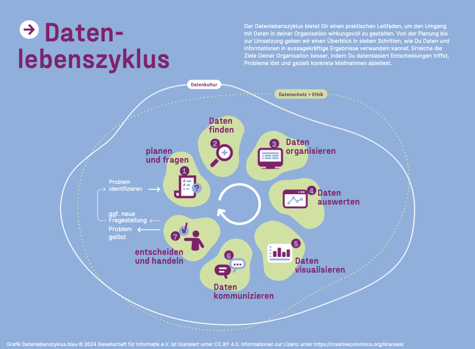

# CiviCRM Daten analysieren und visualisieren

Immer mehr zivilgesellschaftliche Organisationen nutzen die Open Source Software [CiviCRM](https://civicrm.org/). Kontakte, Spenden, Mitglieder oder Events managen, Kampagnen durchführen, mit den eigenen Zielgruppen kommunizieren oder Daten zur Wirkungsmessung erheben: CiviCRM kann vieles abbilden, was in zivilgesellschaftlicher Arbeit anfällt. Für viele Organisationen sind ihre CiviCRM-Daten Grundlage ihrer täglichen inhaltlichen Arbeit. Doch **wie können zivilgesellschaftliche Akteur*innen ihre Daten darüber hinaus nutzen** - zur Fördermittelakquise, zur Berichterstattung, zur Wirkungsmessung, zur Verbesserung ihrer Prozesse oder zum organisationellen Lernen?
**Was braucht es, um CiviCRM Daten zu analysieren und zu visualisieren**?

Diese Fragen zu erkunden, war das Ziel eines internen Datenvorhabens, welches ein Team des [Civic Data Labs](https://civic-data.de) im Sommer 2025 durchgeführt hat. Dieses Material dokumentiert die Ergebnisse. Es richtet sich vor allem an **Personen, die CiviCRM bereits nutzen und ihre CiviCRM Daten analysieren (wollen)**. Aber auch Personen, die überlegen, CiviCRM in ihrer Organisation einzuführen, oder die an Open Source Software interessiert sind, sind herzlich willkommen, hier durchzustöbern. 

## Wie nutzt die Zivilgesellschaft CiviCRM?
Im Sinne der partizipativen Technikgestaltung haben wir im Rahmen des Datenvorhabens schriftlich und in persönlichen Gesprächen **Meinungen, Bedarfe und Anfoderungen von zivilgesellschaftlichen CiviCRM-Nutzer*innen** eingeholt. Wir danken allen, die mit uns ihre Anliegen geteilt haben. 
Es zeigte sich, dass es eine große Varianz gibt - in der Nutzung von CiviCRM, aber auch in den Wünschen und Anforderungen an Auswertungen der eigenen Daten. 

### Welche Daten pflegen Organisationen in CiviCRM?

Standardmäßig nutzen zivilgesellschatliche Organisationen  CiviCRM für **Kontakte** (Personen, Organisationen), häufig auch für **Mitgliederverwaltung, Spendenmanagementoder  Veranstaltungsmanagement**.

Speziellere Anwendungsfälle sind z.B.: 

- Fördermittel/Fondsverwaltung
- Case-/Projektmanagement und Aktivitäten 
- Engagement-/Integrationsdaten
- Kampagnen- und politische Arbeit

### Welche Auswertungen wären besonders hilfreich?
- Finanz- und Spendenberichte: Entwicklung von Spendenaufkommen, Zusammensetzung (Dauer-/Einzelspenden), Verknüpfung mit Aktivitäten.
- Fördermittelmonitoring: Anzahl und Volumen bewilligter Projekte, regionale Verteilungen, Vergleich nach Zielgruppen.
- Mitglieder- und Verbandsentwicklung: Entwicklung nach Region, Alter, Interessen, Potenziale für Beitragsmodelle.
- Veranstaltungen & Engagement: Teilnahmestatistiken, Übergang von Veranstaltungen ins Ehrenamt, Bindungs- und Austrittsgründe.
- Politische Kommunikation: Datenaufbereitung für Sachberichte, Evaluationen, Präsentationen an Ministerien, Fördergeber oder Öffentlichkeit.

## CiviCRM Daten im Datenlebenszyklus

Der [Datenlebenszyklus](https://civic-data.de/datenlebenszyklus/) gibt einen Überblick über den Ablauf einer Datenanalyse - von der Planung bis hin zur Umsetzung. Wir verwenden den Datenlebenszyklus hier, um Komponenten und Tools den Schritten zuzuordnen. Wir fokussieren uns dabei auf die folgenden Aspekte:

- **Daten organisieren**: wo und wie werden Daten gespeichert? Wie werden sie verwaltet und wie werden sie bereinigt?
- **Daten auswerten**: wie werden Daten analysiert? Wie werden Ergebnisse analysiert?
- **[Daten visualisieren](https://civic-data.de/datenlebenszyklus/daten-visualisieren/)**: wie werden Daten visuell ansprechend und passend für die Zielgruppe aufbereitet? 
- **[Daten kommunizieren](https://civic-data.de/datenlebenszyklus/daten-kommunizieren/)**: Wie werden Ergebnisse zielgruppengerecht kommuniziert und geteilt?
- **Daten verbinden & Datenflüsse ermöglichen**: Zusätzlich zu den Schritten des Datenlebenszyklus ist es bei den Experimenten sehr relevant gewesen, Komponenten und Tools miteinander zu integrieren, sie zu verbinden und Datenflüsse zu ermöglichen. Deshalb sprechen wir zusätzlich auch von *Daten verbinden & Datenflüsse ermöglichen*. 
- **Datenschutz**: Da in CiviCRM fast immer personenbezogene Daten gespeichert werden, spielt Datenschutz als Rahmenthema eine wichtige Rolle.

