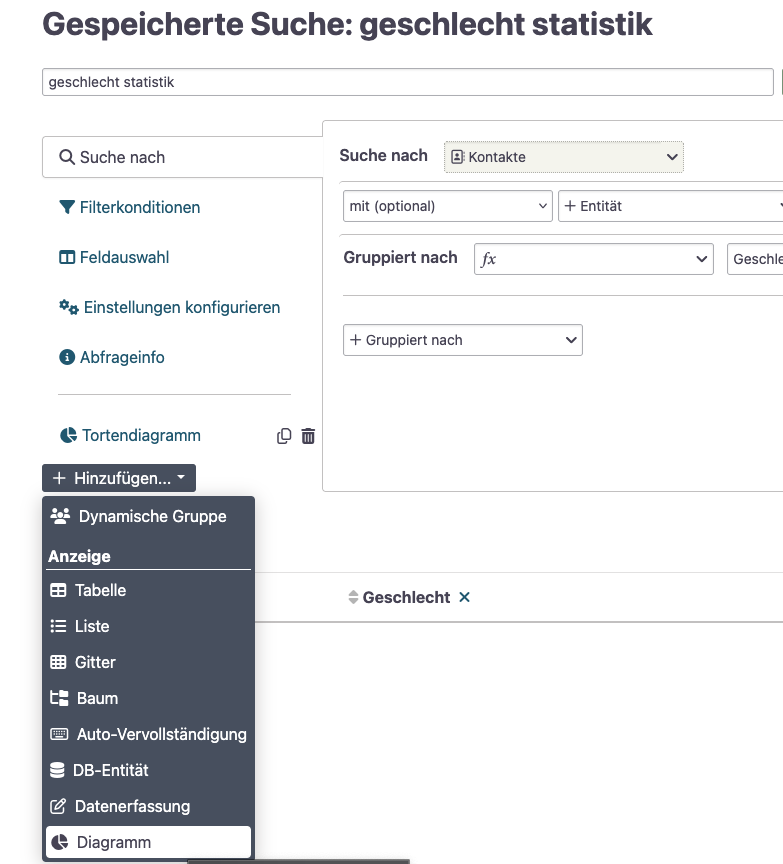

# SearchKit + Excel / Google Sheets

_**SearchKit Suchergebnisse über die API in Excel oder Google Sheets laden - Datenvisualisierung und weitere Auswertung dort.**_

[💾 daten-organisieren](./../datenlebenszyklus.html#daten-organisieren): CiviCRM Datenbank  
[🔢 daten-auswerten](./../datenlebenszyklus.html#daten-auswerten): SearchKit  
[📊 daten-visualisieren](./../datenlebenszyklus.html#daten-visualisieren): Excel bzw. Google Sheets  
[⚙️ daten-verbinden](./../datenlebenszyklus.html#daten-verbinden): Power Query bzw. Google Appscript 

## SearchKit, Excel und Power Query

### Voraussetzungen
- CiviCRM API Schlüssel, um auf eure Instanz zuzugreifen. Zugriff auf die Endpunkte:
    - `ajax/api4/SavedSearch/get`
    - `ajax/api4/SearchDisplay/download`
- Lizenz für *Microsoft Excel Desktop Version*[^note-powerquery], optional für *Excel für das Web*

[^note-powerquery]: Für die Einrichtung und Konfiguration ist die Desktop Version von Excel notwendig. Das Abrufen der Daten funktioniert dann auch unter Excel für das Web, wenn man die Datei hochgeladen hat. Der Ansatz wurde getestet unter Microsoft Excel for Mac, Version 16.100.3 unter der Lizenz Microsoft 365.

### Anleitung

_Screenshots in den Fußnoten_

1. Lade die `test-excel.xlsx` Datei aus dem [GitHub Repository](https://github.com/CorrelAid/cdl_civicrm_analyse/blob/main/supporting_code/powerquery/test-excel.xlsx) herunter. Dazu oben rechts auf die drei Punkte und dann auf "Download" bzw. "Herunterladen" klicken.
2. Öffne die Datei in der Desktop Version von Microsoft Excel. 
3. Aktiviere die externen 
4. Öffne den Power Query Editor über den Ribbon Daten -> Daten abfragen (Power Query) -> Power Query-Editor starten.[^screenshot-pq-oeffnen]
5. In der Seitenleiste links wähle den Eintrag `CiviToken`. Gebe deinen API Schlüssel für die CiviCRM API ein. Klicke auf "Übernehmen".[^screenshot-civitoken-edit]

[^screenshot-pq-oeffnen]: Screenshot Power Query-Editor öffnen 
[^screenshot-civitoken-edit]: Screenshot CiviToken editieren

## SearchKit, Google Sheets und Google Apps Script

