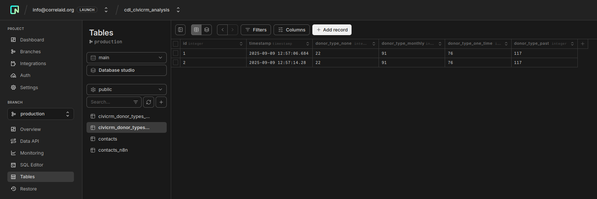

# Managed Datenbank

Managed Datenbanken sind cloud-basierte Datenbankdienste, bei denen sich der Anbieter um die technische Infrastruktur, Wartung und Skalierung kümmert. Der Anbieter übernimmt Aufgaben wir das Durchführen von automatische Updates oder Backups. 

Die Hauptvorteile liegen in der Zeitersparnis durch wegfallende Server-Administration. Nachteile gegenüber dem [Self-Hosting](./tools/self-hosting.md) sind höhere Kosten, Vendor Lock-in und eingeschränkte Konfigurationsmöglichkeiten.

Im Kontext der Visualisierung und Analyse von CiviCRM-Daten können managed Datenbanken als sogenanntes **Data-Warehouse** zum Einsatz kommen. Ein Data-Warehouse ist eine Datenbank, die speziell für Analysen und Berichte optimiert ist und Daten aus verschiedenen Quellen sammelt und strukturiert. 

Wir konzentrieren uns in diesem Projekt auf **relationale** Datenbanken mit **SQL**(Structured Query Language). Relationale Datenbanken organisieren Daten in Tabellen mit Zeilen und Spalten, ähnlich wie Excel-Tabellen. Die Tabellen können über gemeinsame Spalten (Keys) miteinander verknüpft werden. SQL ist die Standardsprache für das Abfragen und Verwalten dieser Datenbanken. 

### Serverless Datenbanken

Serverless ist eine spezielle Form von Managed Datenbanken mit zusätzlichen Vorteilen. Normalerweise bezahlt man bei managed Datenbaken für die permanente Nutzung eines Servers, auf der die Datenbank läuft. Wie der Name beschreibt, fällt dies bei serverless jedoch weg. Konkret bedeutet das Pay-per-Use-Bezahlung nur für tatsächlich verbrauchte Ressourcen und die Möglichkeit des "Cold Start". Dies bedeutet, dass die Datenbank bei Inaktivität pausieren und bei Bedarf reaktiviert werden kann.

**Warum ist Serverless ideal für CiviCRM-Analysen?** Bei der Nutzung eine Datenbank als externes Data Warehouse wird diese typischerweise nicht kontinuierlich abgefragt, sondern hauptsächlich für periodische Berichte und Analysen genutzt. Serverless bietet daher Kosteneffizienz bei unregelmäßiger Nutzung.

### Grafische Nutzeroberfläche statt SQL

SQL schreiben zu können ist ein nützlicher Skill; es zu lernen erfordert jedoch Zeit. Eine Alternative ist die Verwaltung einer Datenbank über grafische Nutzeroberflächen.

Moderne managed Datenbanken bieten oft webbasierte Oberflächen, die es ermöglichen, Tabellen zu erstellen, Daten einzufügen und anzuzeigen, ohne SQL-Code schreiben zu müssen. Diese Oberflächen funktionieren ähnlich wie Excel und reduzieren die Einstiegshürde erheblich. Gleichzeitig bleibt die Option bestehen, bei Bedarf auf SQL-Befehle zurückzugreifen.

## Neon

[💾 daten-organisieren](./../datenlebenszyklus.html#daten-organisieren)

[Neon](https://neon.com) ist eine serverless PostgreSQL-Datenbank, die sich komplett im Browser über eine intuitive GUI verwalten lässt. Wir haben uns bei unseren Experimenten für die Nutzung Neon entschieden, weil es serverless ist und gleichzeitig eine benutzerfreundliche Weboberfläche bereitstellt.

### Vorteile

- GUI-Management: Tabellen können direkt im Browser erstellt und verwaltet werden
- PostgreSQL: Vollständig kompatibel mit dem dem weit verbreitenden SQL-Flavor Postgres
- Automatische Backups und Sicherheit
- Kostenloser Plan für kleinere Projekte verfügbar
- Datenbanken können in der EU betrieben werden 

### Nachteile

- Nicht Open Source
- Bei sehr intensiver Nutzung können Kosten steigen
- Weniger Kontrolle über die Infrastruktur (Neon nutzt AWS oder Azure in der EU)

### Betrieb

Neon eignet sich besonders gut für CiviCRM-Analysen, da die Datenbank typischerweise nicht kontinuierlich abgefragt wird, sondern hauptsächlich für periodische Berichte und Analysen genutzt wird. Die serverless Architektur und die EU-Verfügbarkeit machen es zur idealen Lösung für deutsche Organisationen.

### Anlegen einer Datenbank und Tabelle

Arbeite dich durch das Neon Setup bis zu [Onboarding](https://neon.com/docs/get-started/signing-up). Nun steht dir eine Datenbank zur Verfügung! 

[Hier](https://neon.com/docs/guides/tables) wird erklärt wie Neon im Browser bedient werden kann und Tabellen erstellt werden können. Für die Erstellung von Tabellen kann auch der SQL Editor verwendet werden.

## Alternativen

### Supabase

[Supabase](https://supabase.com/) bietet ähnliche Funktionen wie Neon, ist jedoch mehr auf Echtzeitanwendungen ausgerichtet und nicht serverless.

### Scaleway Serverless SQL

[Scaleway](https://www.scaleway.com/en/serverless-sql-database/) ist ein französischer Anbieter einer umfangreichen Zahl an Cloud-Angeboten, bietet jedoch für serverless Datenbanken eine weniger umfangreicherer GUI als Neon.

