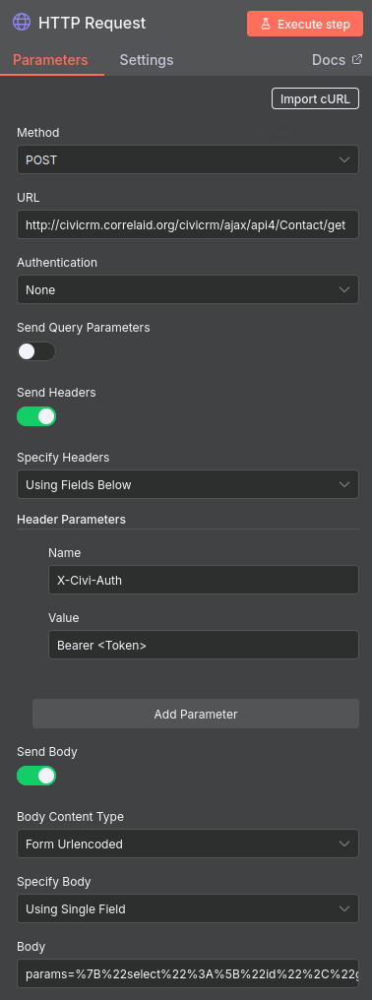
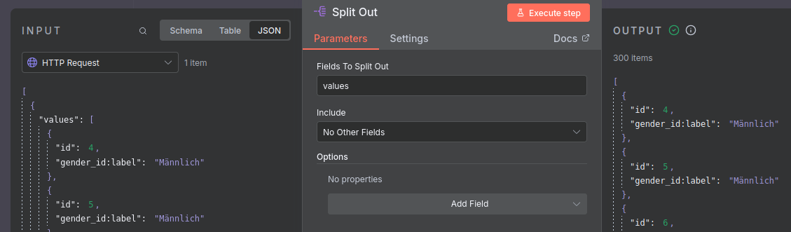
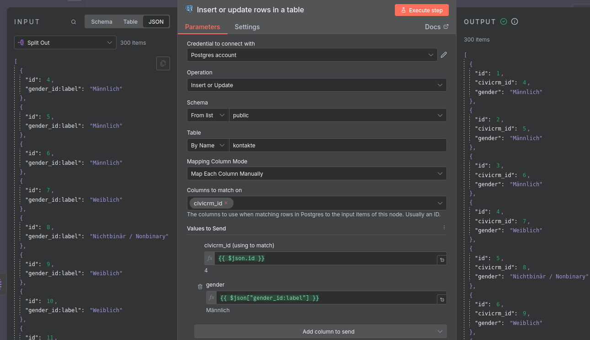
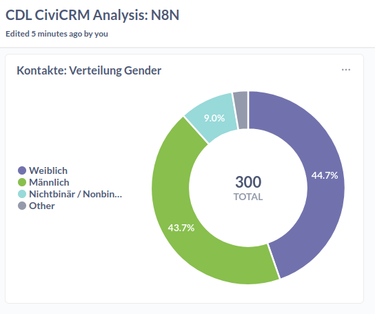

# Einfache deskriptive Statistiken visualisieren

Wir stellen uns die Frage, wie sich Geschlecht unter den in CiviCRM erfassten Kontakten verteilt und wollen dafür einen Donut-Chart bauen. 

### Anleitung 

### Anlegen einer Tabelle in der Managed Datenbank (Neon)

 Erstelle eine neue Tabelle, wie [hier](http://localhost:3000/tools/managed-datenbank.html#anlegen-einer-datenbank-und-tabelle) beschrieben, mit dem Namen *kontakte* und füge neben der automatischen ID-Spalte lediglich die Spalten **civicrm-id** und **gender** ein. Ersteres sollte den Datentyp **integer** haben, und als contraints ***Not null**, sowie **Unique** haben. Zweiteres sollte den Datentyp **varchar** und den constraint **Not null**.

 Als SQL, das man auch in den SQL Editor einfügen kann, um die Tabelle zu erstellen, sieht das so aus:

 ```
 CREATE TABLE "kontakte" (
  "id" integer PRIMARY KEY GENERATED ALWAYS AS IDENTITY (sequence name "kontakte_id_seq"),
  "civicrm_id" integer NOT NULL UNIQUE,
  "gender" varchar
);
```

ℹ️ Diesen und anderen SQL-Code findet ihr auch im [Repository](https://github.com/CorrelAid/cdl_civicrm_analyse) in dem Ordner `supporting_code/sql`.


#### Datenmodellierung im API Explorer

Navigiert zum [API Explorer](../../tools/civicrm_intern/3-civicrm-api.html#api-explorer) und wählt als Entität **Contact**, sowie als Aktion **get** aus. Unter select, wählt **gender_id:label** und **id** aus. Wichtig ist, dass ihr außerdem **-1** bei **limit** setzt, um alle Daten zu erhalten. Bei diesem Use Case beschränkt sich das Data Modeling auf die Feldauswahl. 

🤔 Kleiner Exkurs: **gender** ist eine separate Tabelle, die alle auf dieser CiviCRM auswählbaren Gender enthält. Kontakte haben ein Feld mit dem Namen **gender_id**, dass die ID einer Reihe in der Gender-Tabelle enthält, die zum Beispiel als Spalte **Label** hat. 

Nach diesen Schritten könnt ihr bereits den Request Body weiter unten unter REST kopieren. Dies sollte entsprechen: `params=%7B%22select%22%3A%5B%22gender_id%3Alabel%22%2C%22id%22%5D%7D`.

### Anlegen des Flows in n8n

Auf eurer [n8n](../../tools/workflow-tools.html#n8n) Instanz, erstellt einen neuen Workflow. Am Ende sollte dieser so aussehen:


ℹ️ Den Flow als importierbare Datei findet ihr auch im [Repository](https://github.com/CorrelAid/cdl_civicrm_analyse) in dem Ordner `supporting_code/n8n_flows`. Dies solltet ihr so nicht nachmachen, da der Flow in dieser Version auch ein API Token enthält.

Als Trigger dient sowohl die manuelle Ausfühurng als auch eine Schedule (regelmäßig terminiertes Ausführen). Letzteres kann zum Beispiel einmal am Tage geschehen. 

#### Knoten: API-Anfrage

Der erste richtige Knoten ist die API-Anfrage. Unten seht ihr, wie ihr ihn konfigurieren müsst.



Fügt unter URL am Anfang die URL eurer Instanz ein. Im API Explorer unter dem Rest Reiter ist dies auch als Variable **CRM_URL** definiert. Wie ihr ein API Token erhaltet, lernt ihr [hier](http://localhost:3000/tools/civicrm_intern/3-civicrm-api.html#api-einrichten). 

Im Feld Body, das bei Setzen der oben angezeigten Optionen erscheint, fügt ihr nun den im API-Explorer generierten Body ein (siehe oben). Dies könnt ihr direkt mit einem Klick auf "Execute Workflow" testen.

🤔 Hinweis: Wenn mehr als ein paar hundert Kontakte in CiviCRM habt, oder viele Datenfelder verarbeitet, solltet ihr nicht alle Daten auf einmal anfragen, sondern mit Pagination arbeiten. Dies lässt sich im API-Explorer konfigurieren und in n8n [so](https://docs.n8n.io/integrations/builtin/core-nodes/n8n-nodes-base.httprequest/#pagination) berücksichtigen.

#### Knoten: Zeilen separieren

Der Output des vorherigen Knotens ist standardmäßig ein json Objekt, das die Daten als Liste als Wert des keys "values" enthält. Der Knoten-Typ **Split Out** ermöglicht es uns, diese Liste, bzw. deren Einträge zu isolieren. 



Die Konfiguration dieses Knotens ist simpel: füllt das Feld **Values to Split Out** einfach mit dem Wert **values**.

#### Knoten: Daten in die managed Datenbank laden

Dieser letzte Knoten ist für das Laden der Daten in die managed Datenbank auf Neon, unser Data Warehouse, zuständig. 

Legt zunächst ein Credential für Postgres an. Wie dies funktioniert, ist [hier] beschrieben. Die notwendigen Informationen findet ihr auf Neon [so](https://neon.com/docs/connect/connect-from-any-app).



Wenn ihr dies erledigt habt, nutzt den Knoten-Typ für Postgres: **Insert or update rows in a table** und konfiguriert ihn so wie im Bild oben. Wählt die Tabelle aus, die ihr im ersten Schritt angelegt habt. Bei der Zuordnung der Felder aus der API zu den Spalten der Tabelle ist wichtig, dass es einen Unterschied zwischen **id**, die automatisch erstellt wird, und **civicrm_id**, die Updates von bereits vorhanden Kontakten erlaubt, gibt. So wird sichergestellt, dass bei erneutem Laden der Daten keine Duplikate entstehen.

🤔 Kleiner Exkurs: In den Begriffen des Data Engineering vollziehen wir hier einen regelmäßigen **Full Load**. Eine alternative wäre ein ressourcensparender **incremental load**, bei dem nur neue Daten geladen werden. Neu könnte mit Bezug auf Kontakte meint solche, die geupdatet oder SWtatsächlich neu hinzugekommen sind. Incremental Loads können jedoch komplex werden, auch weil sie Informationen wie das Datum eines Updates und die zuverlässige Sortierung von API Ergebnissen voraussetzen.

### Visualisierung in Metabase

Verbindet wie [hier](http://localhost:3000/tools/bi-tools.html#verbinden-von-datenbanken-mit-metabase) beschrieben die Datenbank mit Metabase. An die notwendigen Informationen kommt ihr ähnlich wie beim Anlegen der Postgres Credentials für den letzten Knoten des Workflows. 



Die obige Visualisierung ist ein **Pie-Chart**, für den die Daten mit der **Summarize** Funktion verarbeitet wurden, indem die Reihen pro Gender gezählt wurden.

